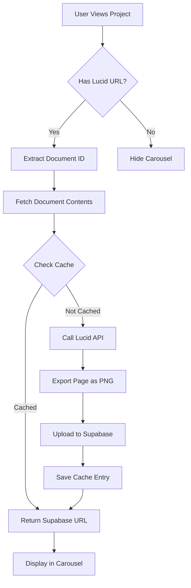

# Lucid Chart Carousel Debug Guide

## Overview
This guide helps troubleshoot and debug the Lucid Chart carousel implementation that displays wiring diagram thumbnails on project pages.

## Current Implementation Status

### ✅ Components Created
- **LucidChartCarousel.js** - Main carousel component with swipe functionality
- **lucidCacheService.js** - Service for caching images in Supabase storage
- **LucidChartDebug.js** - Comprehensive debugging tool

### ✅ Infrastructure
- **Supabase Storage Bucket** - `lucid-chart-cache` for storing images
- **Database Table** - `lucid_chart_cache` for tracking cached images
- **SQL Migration** - `supabase/lucid_chart_cache.sql`

### ✅ Integration Points
- Carousel is integrated into:
  - `PMProjectViewEnhanced.js`
  - `ProjectDetailView.js`

## Debugging Steps

### Step 1: Check Environment Variables
Ensure your `.env.local` file contains:
```bash
REACT_APP_LUCID_API_KEY=your_lucid_api_key_here
```

### Step 2: Run Database Migration
Execute the Supabase migration to create the storage bucket and table:
```bash
# Using Supabase CLI
supabase db push

# Or manually in Supabase SQL editor:
# Copy contents of supabase/lucid_chart_cache.sql
```

### Step 3: Use the Debug Tool
1. Navigate to: `http://localhost:3000/lucid-chart-debug`
2. Enter a Lucid Chart URL (format: `https://lucid.app/lucidchart/YOUR-DOC-ID/edit`)
3. Click "Run Diagnostics"

The debug tool will check:
- ✓ API key configuration
- ✓ Document ID extraction
- ✓ Supabase bucket existence
- ✓ Database table existence
- ✓ Document content fetching
- ✓ Image export functionality
- ✓ Cache service operations
- ✓ Network connectivity

### Step 4: Check Browser Console
Open Developer Tools (F12) and look for:
- API call responses
- Error messages
- Console logs from the cache service

## Common Issues and Solutions

### Issue 1: "Unable to load image" placeholder
**Causes:**
- Missing API key
- Supabase bucket not created
- CORS issues with Lucid API

**Solutions:**
1. Verify API key is set in environment variables
2. Run the SQL migration
3. Check network tab for failed requests

### Issue 2: Images not caching
**Causes:**
- Storage bucket permissions
- Database table missing
- RLS policies not configured

**Solutions:**
1. Verify bucket is public in Supabase dashboard
2. Check table exists: `select * from lucid_chart_cache limit 1;`
3. Verify RLS policies are enabled

### Issue 3: Carousel not appearing
**Causes:**
- No `lucid_chart_url` in project data
- Component not imported correctly

**Solutions:**
1. Check project has `lucid_chart_url` field
2. Verify import statements in parent components

## API Flow



## Testing Checklist

- [ ] API key is configured in `.env.local`
- [ ] Database migration has been run
- [ ] Storage bucket `lucid-chart-cache` exists
- [ ] Table `lucid_chart_cache` exists
- [ ] Project has valid `lucid_chart_url`
- [ ] Browser allows CORS requests to Lucid API
- [ ] Supabase storage is publicly accessible

## Manual Testing

### Test Image Export
```javascript
// In browser console on /lucid-chart-debug
const testExport = async () => {
  const apiKey = process.env.REACT_APP_LUCID_API_KEY;
  const documentId = 'your-doc-id';
  
  const response = await fetch(
    `https://api.lucid.co/documents/${documentId}?pageNumber=0`,
    {
      headers: {
        'Authorization': `Bearer ${apiKey}`,
        'Lucid-Api-Version': '1',
        'Accept': 'image/png'
      }
    }
  );
  
  if (response.ok) {
    const blob = await response.blob();
    const url = URL.createObjectURL(blob);
    window.open(url);
  } else {
    console.error('Export failed:', response.status);
  }
};
```

### Test Cache Service
```javascript
// Test cache service directly
import { getCachedPageImage } from './services/lucidCacheService';

const testCache = async () => {
  const documentId = 'your-doc-id';
  const pageIndex = 0;
  
  try {
    const imageUrl = await getCachedPageImage(documentId, pageIndex, {
      title: 'Test Page'
    });
    console.log('Cached image URL:', imageUrl);
  } catch (error) {
    console.error('Cache error:', error);
  }
};
```

## Production Considerations

1. **API Rate Limits**: The service implements batching (3 pages at a time) with delays
2. **Cache Duration**: Images are cached for 7 days by default
3. **Storage Limits**: Each image has a 5MB limit
4. **Fallback**: Base64 placeholders are generated if API fails

## Support Resources

- [Lucid API Documentation](https://developer.lucid.co/rest-api/v1/)
- [Supabase Storage Guide](https://supabase.com/docs/guides/storage)
- Debug Tool: `/lucid-chart-debug`
- Test Routes: `/lucid-chart-test`

## Next Steps if Still Not Working

1. **Check Lucid API Access**:
   - Verify API key has correct permissions
   - Test with Postman/curl directly
   
2. **Inspect Network Traffic**:
   - Use browser DevTools Network tab
   - Look for 401/403 errors from Lucid API
   
3. **Verify Supabase Setup**:
   - Check Supabase dashboard for storage bucket
   - Verify RLS policies are active
   - Test direct upload to bucket

4. **Test with Sample Document**:
   - Create a simple test diagram in Lucid
   - Make it publicly accessible
   - Try with that document ID

## Contact for Help

If issues persist after following this guide:
1. Check browser console for specific error messages
2. Run the diagnostic tool and screenshot results
3. Check Supabase logs for storage errors
4. Verify Lucid API key permissions
