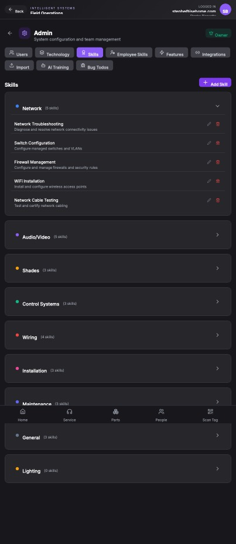

## Summary

The app only supports two levels of skill categories (Category and Skill), but the user needs a third level to better organize skills.

## User Description

We need three levels instead of two

## Steps to Reproduce

1. Navigate to https://unicorn-one.vercel.app/admin
2. [Steps from user description need to be extracted manually]

## Expected Result

[To be determined from user description]

## Actual Result

The current data model and UI only support two levels of hierarchical skills: a main category (e.g., Network) and individual skills within that category (e.g., Network Troubleshooting). The user's request to support three levels likely involves adding a subcategory level between the main category and individual skills. The data model in the database must be updated to allow for this third level.

## Console Errors

```
[2026-01-07T19:49:44.452Z] [ServiceTicketService] Failed to add note: [object Object]

[2026-01-07T19:49:44.452Z] [ServiceTicketService] Failed to add ticket note: Error: new row for relation "service_ticket_notes" violates check constraint "service_ticket_notes_note_type_check"
addNote@https://unicorn-one.vercel.app/static/js/210.14634242.chunk.js:1:4864

[2026-01-07T19:49:55.624Z] [ServiceTicketService] Failed to add note: [object Object]

[2026-01-07T19:49:55.625Z] [ServiceTicketService] Failed to add ticket note: Error: new row for relation "service_ticket_notes" violates check constraint "service_ticket_notes_note_type_check"
addNote@https://unicorn-one.vercel.app/static/js/210.14634242.chunk.js:1:4864
```

## Screenshot



## AI Analysis

### Root Cause
The current data model and UI only support two levels of hierarchical skills: a main category (e.g., Network) and individual skills within that category (e.g., Network Troubleshooting). The user's request to support three levels likely involves adding a subcategory level between the main category and individual skills. The data model in the database must be updated to allow for this third level.

### Suggested Fix

1. **Database Schema Modification**: Alter the `skills` and/or `skill_categories` tables to include a `parent_category_id` to create a hierarchical structure. Ensure the `note_type_check` constraint is updated or removed if it conflicts with the new hierarchy. You need to decide on a new name for the third level.
2. **Backend API Modification**: Update the API endpoints that manage skills and skill categories to handle the new hierarchical structure. This includes creating, reading, updating, and deleting categories and skills. Pay special attention to how the data is validated.
3. **Frontend UI Modification**: Modify the admin UI (likely in `src/pages/Admin/Skills.js` or a similar component responsible for displaying the skills) to display three levels of skill categories. This will likely require changes to the component's state management and rendering logic. Consider using a tree-like structure to visually represent the hierarchy. Handle adding, editing, and deleting skills at each level.

### Affected Files
- `src/api/skills.js`: Update API calls related to skills to handle the new 3-level category structure.
- `src/pages/Admin/Skills.js`: Modify the Skills admin page to display the new 3-level category structure and allow users to manage it.
- `src/db/migrations/xxxx-add-skill-categories.js`: Migration file to add the third level skill category structure in database

### Testing Steps
1. 1. Log in to the admin panel.
2. 2. Navigate to the Skills section.
3. 3. Create a main skill category (Level 1).
4. 4. Create a sub-category within the main category (Level 2).
5. 5. Create a skill within the sub-category (Level 3).
6. 6. Verify that the skill is correctly associated with the sub-category and main category.
7. 7. Edit the skill and verify the changes are saved correctly.
8. 8. Delete the skill and verify that it is removed from the sub-category.
9. 9. Repeat steps 3-8 for different combinations of skill categories and sub-categories to ensure the system works correctly in all scenarios.
10. 10. Check for regressions in the 2-level category scenario

### AI Confidence
90%

---
*Generated by Unicorn AI Bug Analyzer at 2026-01-08T01:27:30.680Z*
