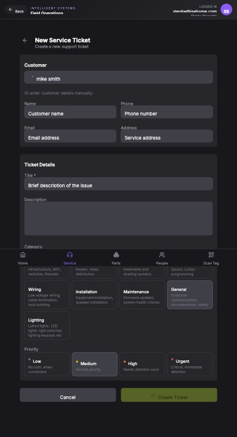

## Summary

Users cannot create a new persistent customer/contact directly from the 'New Service Ticket' page when an existing customer is not found via search, even though fields for manual customer details are available.

## User Description

We need a way to always create a contact if the search does not find a match.  we will have service calls form non customers from time to time and need a way to onboard a new curtomer.

## Steps to Reproduce

1. Navigate to https://unicorn-one.vercel.app/service/tickets/new
2. [Steps from user description need to be extracted manually]

## Expected Result

[To be determined from user description]

## Actual Result

The 'Or enter customer details manually' section on the 'New Service Ticket' form currently captures customer details for the ticket, but it does not trigger the creation and persistence of a new `Customer` or `Contact` entity in the backend database. This means new non-customers cannot be 'onboarded' as permanent records through this workflow, limiting the system's ability to manage new service requests from non-existing clients.

## Console Errors

```
No console errors captured.
```

## Screenshot



## AI Analysis

### Root Cause
The 'Or enter customer details manually' section on the 'New Service Ticket' form currently captures customer details for the ticket, but it does not trigger the creation and persistence of a new `Customer` or `Contact` entity in the backend database. This means new non-customers cannot be 'onboarded' as permanent records through this workflow, limiting the system's ability to manage new service requests from non-existing clients.

### Suggested Fix

Enhance the `NewServiceTicketForm` component to conditionally create a new customer record when a ticket is submitted without a selected existing customer, but with manual customer details provided. This requires modifying the form's submission handler and the associated API interaction.

### Affected Files
- `src/pages/service/tickets/NewServiceTicketPage.jsx` (line N/A (assuming form submission handler)): Locate the form submission handler (e.g., `handleSubmit` or `onCreateTicket`). Inside this function, before calling the `createTicket` API, check if a customer has been selected from the autocomplete. If not, but the manual customer detail fields (name, phone, email, address) are populated, make an API call (e.g., `POST /api/customers`) to create a new customer. Upon successful creation, retrieve the new customer's ID and use it when submitting the `createTicket` API call. If an existing customer is selected, use their ID as usual.
- `src/api/customerApi.js` (line N/A (new function needed)): Add a new API function, e.g., `createCustomer(customerData)`, that makes a POST request to `/api/customers` with the provided customer details (name, phone, email, address) and returns the ID of the newly created customer. This function will be called from the form submission handler.
- `src/components/forms/NewServiceTicketForm.jsx` (line N/A (state management and field handling)): Ensure the state for the manual customer input fields (Name, Phone, Email, Address) is correctly managed and accessible within the form's submission handler. These fields should be cleared after successful ticket creation.

### Testing Steps
1. 1. Navigate to 'New Service Ticket' (https://unicorn-one.vercel.app/service/tickets/new).
2. 2. In the 'Customer' search box, type a name that does not exist in the system (e.g., 'New Test Customer'). Do not select any autocomplete suggestions.
3. 3. Fill in the 'Or enter customer details manually:' fields: Name (e.g., 'New Test Customer'), Phone (e.g., '555-123-4567'), Email (e.g., 'new.test@example.com'), Address (e.g., '123 Main St, Anytown').
4. 4. Fill in the 'Ticket Details' (Title, Description) and select a Category and Priority.
5. 5. Click the 'Create Ticket' button.
6. 6. Verify that the new service ticket is successfully created and the page redirects or shows a success message.
7. 7. Navigate to the 'Customers' or 'Contacts' section of the application.
8. 8. Search for 'New Test Customer'.
9. 9. Verify that a new customer record named 'New Test Customer' with the entered phone, email, and address has been created and is present in the customer list.
10. 10. Open the newly created service ticket and verify that it is correctly associated with the 'New Test Customer'.

### AI Confidence
95%

---
*Generated by Unicorn AI Bug Analyzer at 2026-01-08T01:34:21.502Z*
