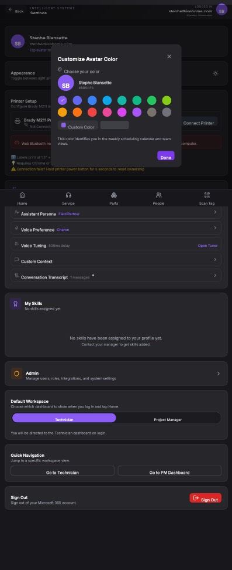

## Summary

Users cannot directly input or edit hex codes for custom avatar colors in the 'Customize Avatar Color' modal because the hex code is displayed as static text instead of an editable input field.

## User Description

Can’t edit hex code for custom colors

## Steps to Reproduce

1. Navigate to https://unicorn-one.vercel.app/settings
2. [Steps from user description need to be extracted manually]

## Expected Result

[To be determined from user description]

## Actual Result

The UI component responsible for rendering the custom color selection in the 'Customize Avatar Color' modal displays the current hex code as static text (e.g., within a <span> or <div> element) rather than an interactive HTML <input type='text'> field. This prevents users from typing or modifying the hex value directly. The functionality to capture and update the color based on user input into a hex code field is likely either missing or not correctly implemented within this component.

## Console Errors

```
[2026-01-08T16:19:11.969Z] [SkillsManager] Load failed: [object Object]

[2026-01-08T16:19:12.063Z] [SkillsManager] Load failed: [object Object]

[2026-01-08T16:34:44.117Z] [SkillsManager] Load failed: [object Object]

[2026-01-09T11:23:01.303Z] [BugReporter] Submit failed: [object Object]

[2026-01-09T11:23:09.730Z] [BugReporter] Submit failed: [object Object]

[2026-01-09T11:23:29.111Z] [BugReporter] Submit failed: [object Object]
```

## Screenshot



## AI Analysis

### Root Cause
The UI component responsible for rendering the custom color selection in the 'Customize Avatar Color' modal displays the current hex code as static text (e.g., within a <span> or <div> element) rather than an interactive HTML <input type='text'> field. This prevents users from typing or modifying the hex value directly. The functionality to capture and update the color based on user input into a hex code field is likely either missing or not correctly implemented within this component.

### Suggested Fix

Locate the React component responsible for the 'Customize Avatar Color' modal, specifically the 'Custom Color' section. Identify where the hex code (e.g., '#5B5CF6') is rendered. Replace the static text element with an <input type='text'> component. This input component must be bound to a state variable holding the hex color value and include an onChange event handler to update the state as the user types. Implement input validation to ensure the entered text is a valid hex code and provide real-time feedback (e.g., update the adjacent color swatch and avatar preview) as the hex code changes. Ensure the 'Done' button correctly saves this new custom hex code to the user's profile.

### Affected Files
- `src/components/settings/CustomizeAvatarColorModal.js` (line N/A (component logic)): Within this modal component, find the rendering of the custom color hex value. Replace the static display element with an editable input field. Add state management for the input value and an onChange handler.
- `src/services/userService.js` (line N/A (function signature)): Ensure the API call for updating user settings/profile supports passing a custom hex color value and that the backend properly persists it.

### Testing Steps
1. Navigate to /settings, click on the avatar preview to open the 'Customize Avatar Color' modal.
2. Select 'Custom Color'.
3. Verify that the hex code display is now an editable input field.
4. Type a new valid hex code (e.g., '#FF00FF') into the input field and observe if the avatar preview and the color swatch update in real-time.
5. Click 'Done'. Close and reopen the modal to confirm the custom color has been saved and is pre-selected.
6. Verify that selecting a pre-defined color and then switching back to 'Custom Color' correctly displays the last custom color saved.

### AI Confidence
95%

---
*Generated by Unicorn AI Bug Analyzer at 2026-01-09T12:00:20.925Z*
