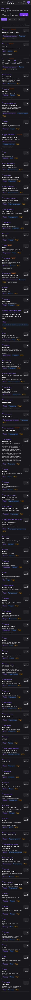

## Summary

Notification badge for new global parts is missing from the navigation, and there's no filter to view them in the parts catalog.

## User Description

Flag global parts to show new part added (so we know to check the settings and update new parts with necessary information.    Can we make the global parts button on the bottom show a red bible with the count of how many new parts have been added.  Just like Apple IOS has a count badge of new item in an app?   Then inside global parts put a quick “show new” button with the search and sort fields

## Steps to Reproduce

1. Navigate to https://unicorn-one.vercel.app/parts
2. [Steps from user description need to be extracted manually]

## Expected Result

[To be determined from user description]

## Actual Result

The application lacks an implemented feature to track 'new' parts, display a count badge on the global parts navigation item, or provide a UI filter to specifically show recently added parts within the parts catalog. This is a missing feature, not a functional bug.

## Console Errors

```
No console errors captured.
```

## Screenshot



## AI Analysis

### Root Cause
The application lacks an implemented feature to track 'new' parts, display a count badge on the global parts navigation item, or provide a UI filter to specifically show recently added parts within the parts catalog. This is a missing feature, not a functional bug.

### Suggested Fix

Implement a new feature to flag, count, and display new global parts. This involves backend changes to manage 'new' status, and frontend changes to update navigation and the parts catalog UI.

1.  **Backend/API (`src/api/partsService.js` or similar):**
    *   Add a new field (e.g., `isNew: boolean` or `addedDate: Date`) to the part schema in the database. When a new part is created, `isNew` should be true or `addedDate` set to the current timestamp.
    *   Create a new API endpoint (e.g., `/api/parts/new/count`) that returns the total number of parts where `isNew` is true or `addedDate` is within a defined 'new' period (e.g., last 7 days), and `reviewedByAdmin` is false.
    *   Create an API endpoint (e.g., `/api/parts?status=new`) to fetch only parts marked as 'new' and unreviewed.
    *   Create an API endpoint (e.g., `/api/parts/{id}/mark-reviewed`) to allow marking a part as 'reviewed' (setting `isNew` to false or `reviewedByAdmin` to true).

2.  **Global Navigation Component (`src/components/GlobalNav.js` or `src/layout/FooterNav.js`):**
    *   Identify the component responsible for rendering the bottom navigation bar. Locate the 'Parts' or 'Global Parts' button/link.
    *   In this component, add a `useEffect` hook to fetch the `newPartsCount` from the new `/api/parts/new/count` endpoint on component mount and whenever relevant dependencies change (e.g., user logs in, new part added via a websocket or polling).
    *   Conditionally render a badge (e.g., using a UI library's Badge component) with the `newPartsCount` on the 'Parts' navigation item if `newPartsCount` > 0.
    *   Ensure the count updates dynamically if parts are marked as reviewed or new ones are added.

3.  **Parts Catalog Page Component (`src/pages/PartsCatalog.js` or `src/features/parts/PartsList.js`):**
    *   Add a new button or filter option labeled "Show New" alongside existing filters (like "All Parts", "Prewire Prep").
    *   When the "Show New" button is clicked, update the component's state to reflect this filter being active.
    *   Modify the part fetching logic to include the `status=new` query parameter when calling the parts API if the "Show New" filter is active.
    *   Upon navigating to or applying the "Show New" filter, consider implementing logic to automatically mark the displayed 'new' parts as 'reviewed' (e.g., call the `mark-reviewed` API for each part displayed) or provide a 'Mark All New as Reviewed' button. This interaction should also trigger a refresh of the `newPartsCount` in the global navigation.

4.  **Redux/Context for Global State (if applicable):**
    *   If using Redux or React Context, create a global state slice/context to store `newPartsCount` so it can be easily accessed and updated by both the navigation and parts catalog components.

### Affected Files
- `src/api/partsService.js`: Add API endpoints for fetching new parts count, fetching new parts, and marking parts as reviewed.
- `src/components/GlobalNav.js`: Fetch new parts count and display a badge on the 'Parts' navigation item.
- `src/pages/PartsCatalog.js`: Add a 'Show New' filter button and modify part fetching logic to display new parts. Implement logic to mark new parts as reviewed.
- `src/schemas/partSchema.js`: Update part schema with `isNew` or `addedDate` and `reviewedByAdmin` fields (backend/database).

### Testing Steps
1. 1. As an admin, add a new global part to the system.
2. 2. Verify that a red badge with a count of 1 appears on the 'Parts' or 'Global Parts' button in the application's bottom navigation.
3. 3. Navigate to the 'Parts Catalog' page (https://unicorn-one.vercel.app/parts).
4. 4. Look for and click the newly added 'Show New' filter button.
5. 5. Verify that only the recently added part(s) are displayed in the list.
6. 6. Verify that after viewing the new part(s), the badge count on the global navigation decreases or disappears (if all new parts were viewed/marked as reviewed).
7. 7. Add another new part and repeat to ensure the count updates correctly.

### AI Confidence
70%

---
*Generated by Unicorn AI Bug Analyzer at 2026-01-09T12:37:02.931Z*
