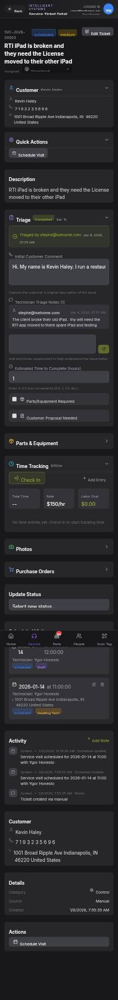

## Summary

Hourly rate for service tickets defaults to $150/hr instead of a dynamic or configurable value.

## User Description

Hourly rate creates at 150/hr

## Steps to Reproduce

1. Navigate to https://unicorn-one.vercel.app/service/tickets/212991de-bf01-4726-93c0-f6d8fc9dd329
2. [Steps from user description need to be extracted manually]

## Expected Result

[To be determined from user description]

## Actual Result

The application's logic for initializing or displaying the hourly rate on service tickets, specifically within the time tracking section, appears to be using a hardcoded value of `150` instead of dynamically fetching a configurable rate (e.g., from technician profile, service type, or ticket-specific settings). This results in the displayed rate always being $150/hr, regardless of actual requirements, leading to potential incorrect billing or data discrepancies.

## Console Errors

```
No console errors captured.
```

## Screenshot



## AI Analysis

### Root Cause
The application's logic for initializing or displaying the hourly rate on service tickets, specifically within the time tracking section, appears to be using a hardcoded value of `150` instead of dynamically fetching a configurable rate (e.g., from technician profile, service type, or ticket-specific settings). This results in the displayed rate always being $150/hr, regardless of actual requirements, leading to potential incorrect billing or data discrepancies.

### Suggested Fix

1. **Identify the source of the hourly rate:** Locate the component responsible for rendering the 'Time Tracking' section on the ticket detail page (e.g., `src/components/TimeTrackingSection.jsx` or a section within `src/pages/service/TicketDetailPage.jsx`). Determine how the `rate` value (currently displaying as $150/hr) is being initialized or passed to this component. This value could be coming from props, component state, or directly from an API response.
2. **Check for hardcoded value:** Search for the literal value `150` within the identified component, its parent components, and any related data fetching logic (e.g., API calls, Redux selectors, React Query hooks, or data transformation functions).
3. **Replace with dynamic retrieval:** If `150` is found to be hardcoded, replace it with logic that fetches the correct hourly rate based on business rules. This might involve:
    - Retrieving `ticket.hourlyRate` from the ticket object if it's stored there.
    - Fetching the default hourly rate from the assigned technician's profile.
    - Fetching the rate based on the service type/category of the ticket.
    - Introducing a configurable global default rate from a settings API if no other specific rate applies.
4. **Consider editability (if applicable):** If the intention is for the rate to be editable per ticket, add an input field (e.g., `<input type="number" />`) in the 'Time Tracking' section. Implement state management to capture user input and an API call to update the ticket's hourly rate on the backend.

### Affected Files
- `src/pages/service/TicketDetailPage.jsx`: This file likely fetches the main ticket data from an API. Check how the 'hourlyRate' is populated within the ticket object that is passed down to child components, or if a default is applied before rendering.
- `src/components/timeTracking/TimeTrackingSection.jsx`: This component is likely responsible for rendering the 'Time Tracking' section. Investigate how the `rate` prop or internal state for the hourly rate is initialized and displayed. Look for hardcoded `150` or an incorrect variable assignment.
- `src/services/ticketService.js`: If there's a service layer for API calls, check functions related to fetching or creating tickets, as the default rate might be set or fetched incorrectly at the data retrieval level.

### Testing Steps
1. Navigate to a new service ticket detail page (or create a new ticket). Verify the 'Hourly rate' displayed in the 'Time Tracking' section reflects the correct, configurable default rate (e.g., based on the assigned technician or service type), and is no longer fixed at $150/hr.
2. If editability was added: Edit the hourly rate for a ticket in the 'Time Tracking' section, save the changes, and verify the new rate is persistently stored and displayed correctly after navigating away and back.
3. Review existing service tickets that were intended to have a different hourly rate (if available in your test data). Verify these existing tickets continue to display their correct, previously set hourly rates and are not inadvertently changed to the new default or $150/hr.
4. Create a new time entry on a ticket and confirm that it correctly uses the displayed hourly rate.

### AI Confidence
70%

---
*Generated by Unicorn AI Bug Analyzer at 2026-01-12T19:15:23.901Z*
