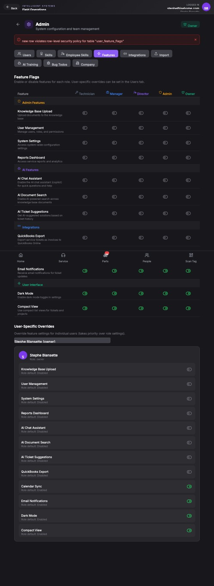

## Summary

Admin users cannot modify feature flags for roles; changes are rejected by database due to row-level security policy.

## User Description

this feature is not working at all,   the idea is to limit the scope of certain functions of this app based on the user level assigned.   It looks like we built an interface but did not implement the back end.

## Steps to Reproduce

1. Navigate to https://unicorn-one.vercel.app/admin
2. [Steps from user description need to be extracted manually]

## Expected Result

[To be determined from user description]

## Actual Result

The backend API call to toggle user features, which likely involves an `INSERT` or `UPDATE` operation on the `user_feature_flags` database table, is being blocked. The specific error message 'new row violates row-level security policy for table "user_feature_flags"' displayed in the UI confirms that the database's Row-Level Security (RLS) is preventing the current authenticated user (who is an 'Owner' based on the screenshot) from performing the necessary write operation (specifically, inserting a new row, which happens when a feature flag is first set for a role). This indicates that the RLS policies for the `user_feature_flags` table are too restrictive for administrative actions.

## Console Errors

```
[2026-01-14T11:10:53.308Z] [AdminPage] Toggle user feature failed: [object Object]
```

## Screenshot



## AI Analysis

### Root Cause
The backend API call to toggle user features, which likely involves an `INSERT` or `UPDATE` operation on the `user_feature_flags` database table, is being blocked. The specific error message 'new row violates row-level security policy for table "user_feature_flags"' displayed in the UI confirms that the database's Row-Level Security (RLS) is preventing the current authenticated user (who is an 'Owner' based on the screenshot) from performing the necessary write operation (specifically, inserting a new row, which happens when a feature flag is first set for a role). This indicates that the RLS policies for the `user_feature_flags` table are too restrictive for administrative actions.

### Suggested Fix

Review and adjust the Row-Level Security (RLS) policies defined for the `public.user_feature_flags` table in your database schema. The current policies are preventing users with administrative roles (like 'Owner' or 'Admin') from inserting or updating feature flag configurations. You need to create or modify the RLS policies to explicitly grant `INSERT` and `UPDATE` permissions to users who are identified as administrators or owners. This typically involves: 
1. Ensuring a `public.profiles` table exists that stores `user_id` and `role` information.
2. Creating a database function (e.g., `is_admin(p_user_id uuid) RETURNS BOOLEAN`) that checks if a given `user_id` has an 'admin' or 'owner' role. 
3. Defining `INSERT` and `UPDATE` RLS policies on `public.user_feature_flags` that utilize this function to allow access for authorized users (e.g., `CREATE POLICY "Allow owners and admins to manage feature flags" ON public.user_feature_flags FOR ALL TO authenticated USING (is_admin(auth.uid())) WITH CHECK (is_admin(auth.uid()));`). Ensure policies cover both `INSERT` and `UPDATE` operations.

### Affected Files
- `src/database/schema.sql`: Locate RLS policy definitions for `public.user_feature_flags`. Adjust or create policies to allow `INSERT` and `UPDATE` operations for 'Owner' and 'Admin' roles based on `auth.uid()` and a role-checking function.
- `src/api/features/toggleFeature.js`: Review the API endpoint responsible for toggling features to ensure it attempts an `UPDATE` if a feature flag for a role already exists, and an `INSERT` only when a new configuration is being established. This reduces unnecessary 'new row' attempts. Also, ensure the error handling propagates specific database errors more clearly instead of generic `[object Object]`.

### Testing Steps
1. Log in as a user with the 'Owner' role (e.g., 'Stephie Blansette').
2. Navigate to the Admin page (URL: `/admin`) and select the 'Features' tab.
3. Attempt to toggle any feature flag for any role (e.g., enable 'Knowledge Base Upload' for the 'Technician' role by clicking the circular icon).
4. Verify that the feature flag state updates successfully in the UI without any red error banners or console errors.
5. Refresh the page to confirm that the changes persist.
6. As a regression test: Log in as a non-admin/non-owner user (e.g., 'Technician'). Attempt to navigate to the Admin page. If accessible, verify they cannot modify feature flags and receive an appropriate permission denied error if they try.

### AI Confidence
95%

---
*Generated by Unicorn AI Bug Analyzer at 2026-01-14T14:55:05.530Z*
