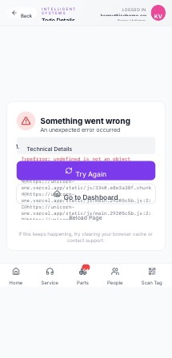

## Summary

Users need to filter wire drops by 'Prewire NOT completed', 'Install NOT completed', and 'COMM Not Completed' to focus on pending tasks, but this filtering functionality is missing.

## User Description

We need a way to show and hide drops (filter) by 1 prewire NOT completed 2 Install NOT completed 3 COMM Not Completed in the wire drops section of each project.   that way the technicians can narrow the scope of the focus to only items that are next up in the workload due.   ie only see the drops where the prewire is not completed

## Steps to Reproduce

1. Navigate to https://unicorn-one.vercel.app/project/32e2fa08-3551-4749-b749-7478aa4781ce
2. [Steps from user description need to be extracted manually]

## Expected Result

[To be determined from user description]

## Actual Result

The application currently lacks the user interface components and the underlying logic required to filter the list of wire drops based on the completion status of the 'Prewire', 'Install', or 'COMM' phases. The existing UI in the 'Wire Drops' section only provides a search bar and general view toggles ('Prewire Mode', 'Full List'), but no specific controls for filtering by task completion status as requested by the user. The console error is likely unrelated to this specific UI/feature gap, originating from a different part of the application (AdminPage).

## Console Errors

```
[2026-01-14T11:10:53.308Z] [AdminPage] Toggle user feature failed: [object Object]
```

## Screenshot



## AI Analysis

### Root Cause
The application currently lacks the user interface components and the underlying logic required to filter the list of wire drops based on the completion status of the 'Prewire', 'Install', or 'COMM' phases. The existing UI in the 'Wire Drops' section only provides a search bar and general view toggles ('Prewire Mode', 'Full List'), but no specific controls for filtering by task completion status as requested by the user. The console error is likely unrelated to this specific UI/feature gap, originating from a different part of the application (AdminPage).

### Suggested Fix

Implement a new filtering mechanism within the 'Wire Drops' section of the Project Detail page. This requires adding interactive UI elements (e.g., a filter button that reveals checkboxes, or dedicated toggle buttons) for 'Prewire Not Completed', 'Install Not Completed', and 'COMM Not Completed'. The component responsible for displaying wire drops must then apply a client-side filter to the data: if any 'NOT completed' filter is active, only wire drops that satisfy *at least one* of the selected incomplete status conditions should be rendered. If no filters are selected, all wire drops should be shown.

### Affected Files
- `src/components/ProjectDetail/WireDropsSection.js` (line N/A (no code provided, typical location for component logic)): This component (or a similar one managing the 'Wire Drops' list) needs modifications:
1.  **UI Integration:** Add a new filter button or directly visible checkboxes/toggles near the existing 'Search wire drops...' and mode buttons. This UI should allow users to select one or more 'NOT completed' criteria.
2.  **State Management:** Introduce component state to manage which filters are currently active (e.g., `const [activeFilters, setActiveFilters] = useState({ prewire: false, install: false, comm: false });`).
3.  **Filtering Logic:** Create a function (e.g., `getFilteredDrops(allDrops, activeFilters)`) that takes the complete list of wire drops and the current filter state. This function should iterate through `allDrops` and return a new array containing only the drops that meet the filtering criteria. The logic should be an 'OR' condition: a drop is included if (`activeFilters.prewire && !drop.isPrewireCompleted`) OR (`activeFilters.install && !drop.isInstallCompleted`) OR (`activeFilters.comm && !drop.isCommCompleted`). If `activeFilters` indicates no filters are applied, return all `allDrops`.
4.  **Render Filtered Data:** Use the output of the filtering function to render the list of individual `WireDrop` components.
- `src/types/project.ts (or similar data model definition)` (line N/A (no code provided)): Ensure that the `WireDrop` data structure includes properties (e.g., `isPrewireCompleted: boolean`, `isInstallCompleted: boolean`, `isCommCompleted: boolean`) that accurately reflect the completion status of each phase. If these fields are missing, they will need to be added to the data model and populated correctly from the backend.

### Testing Steps
1. Navigate to a Project Detail page (e.g., https://unicorn-one.vercel.app/project/32e2fa08-3551-4749-b749-7478aa4781ce).
2. Locate the 'Wire Drops' section and identify the newly added filter controls.
3. Activate the 'Prewire Not Completed' filter. Verify that only wire drops marked as incomplete for the Prewire phase are displayed, and all other drops are hidden.
4. Deactivate 'Prewire Not Completed' and activate 'Install Not Completed'. Verify that only wire drops marked as incomplete for the Install phase are displayed.
5. Activate both 'Prewire Not Completed' and 'Install Not Completed'. Verify that wire drops that are incomplete in *either* the Prewire OR Install phase are displayed.
6. Activate all three filters ('Prewire Not Completed', 'Install Not Completed', 'COMM Not Completed'). Verify that any wire drop incomplete in *any* of the three phases is shown.
7. Deactivate all filters. Verify that the complete list of wire drops is displayed, without any filtering applied.
8. Perform a text search while filters are active to ensure both functionalities work together correctly (e.g., search for 'Cat 6' while 'Prewire Not Completed' is active).

### AI Confidence
95%

---
*Generated by Unicorn AI Bug Analyzer at 2026-01-14T16:10:12.100Z*
