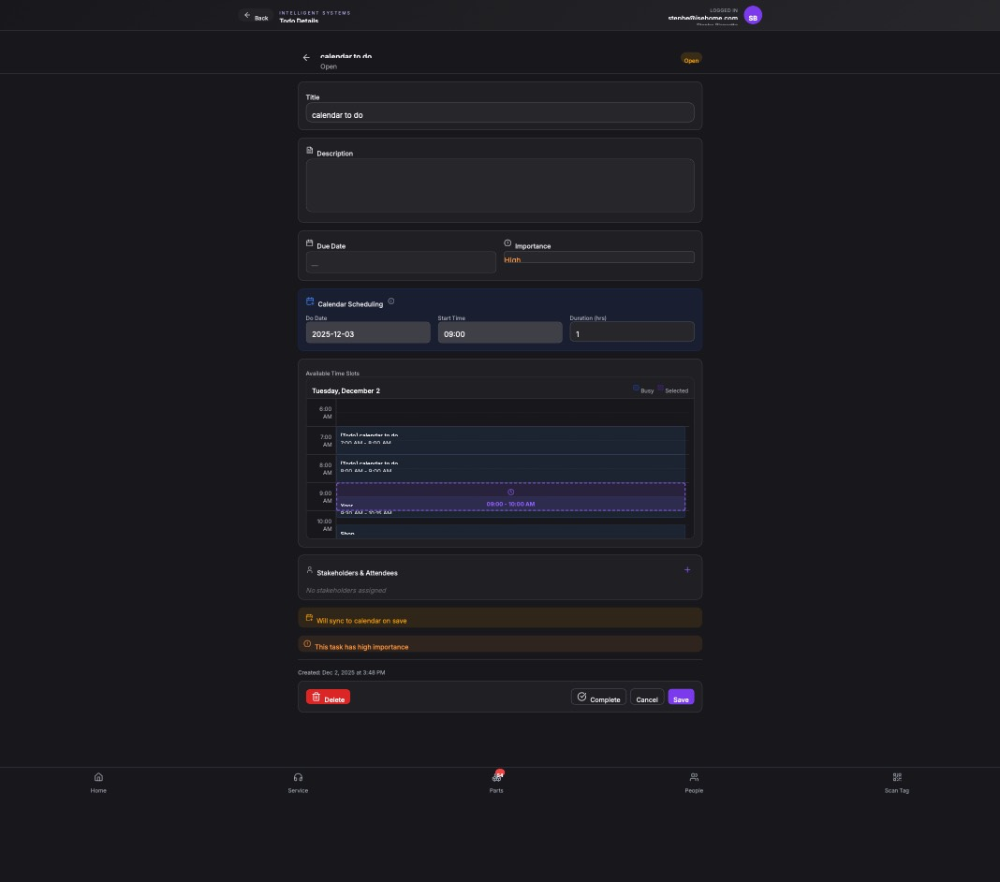

## Summary

Calendar scheduling defaults to an incorrect historical date, places the event on the wrong day, and the page's UI format does not meet internal standards.

## User Description

first the page format does not follow our standards page within a page and has its own back button.  2 Why is it defaulting the calandar view to a day months ago rather than today?  3 when I actually put a  event on the calander to create the todo, it seems to put it in the wrong time slot

## Steps to Reproduce

1. Navigate to https://unicorn-one.vercel.app/projects/32e2fa08-3551-4749-b749-7478aa4781ce/todos/f2c6f2f8-a332-4d4f-a15e-40b390a7abfe
2. [Steps from user description need to be extracted manually]

## Expected Result

[To be determined from user description]

## Actual Result

The primary functional issue is a date inconsistency within the 'Calendar Scheduling' section on the 'Todo Details' page. The 'Do Date' input correctly displays '2025-12-03', but the 'Available Time Slots' calendar component incorrectly defaults its view to 'Tuesday, December 2' (the day prior). Consequently, the scheduled event (09:00 - 10:00 AM) is also visually placed on 'Tuesday, December 2', rather than the intended '2025-12-03'. This strongly suggests that the calendar component or its internal logic is mistakenly deriving its initial display date and the event's date from the todo's `createdAt` property ('Dec 2, 2025', visible in the footer) instead of its `dueDate`, or there is a date parsing/timezone conversion error causing an unintended day shift.

## Console Errors

```
No console errors captured.
```

## Screenshot



## AI Analysis

### Root Cause
The primary functional issue is a date inconsistency within the 'Calendar Scheduling' section on the 'Todo Details' page. The 'Do Date' input correctly displays '2025-12-03', but the 'Available Time Slots' calendar component incorrectly defaults its view to 'Tuesday, December 2' (the day prior). Consequently, the scheduled event (09:00 - 10:00 AM) is also visually placed on 'Tuesday, December 2', rather than the intended '2025-12-03'. This strongly suggests that the calendar component or its internal logic is mistakenly deriving its initial display date and the event's date from the todo's `createdAt` property ('Dec 2, 2025', visible in the footer) instead of its `dueDate`, or there is a date parsing/timezone conversion error causing an unintended day shift.

### Suggested Fix

Locate the `CalendarSchedulingSection` component or the component responsible for rendering the 'Available Time Slots' calendar, likely within `src/features/todos/components/` (e.g., `src/features/todos/components/CalendarSchedulingSection.jsx`).

**1. Ensure Consistent `dueDate` Usage:**
Verify that both the `initialViewDate` prop passed to the calendar component and the `start` and `end` date properties for any displayed events are consistently derived from the `todo.dueDate` property, not `todo.createdAt`.

**2. Robust Date Parsing:**
Pay close attention to how `todo.dueDate` (if it's a string like 'YYYY-MM-DD') is converted into a JavaScript `Date` object. Using `new Date('YYYY-MM-DD')` can lead to timezone-related day shifts. It's safer to explicitly construct a local `Date` object or use a date utility library like `date-fns` with careful parsing.

**Example Adjustment within `src/features/todos/components/CalendarSchedulingSection.jsx`:**
(Assuming `todo` prop contains `dueDate` as a 'YYYY-MM-DD' string, `startTime` as 'HH:MM' string, and `duration` in hours)

javascript
import React from 'react';
import { setHours, addHours, isValid } from 'date-fns';
// Assuming CalendarComponent is your visual calendar library/component
import CalendarComponent from './CalendarComponent'; // Adjust path as needed

function CalendarSchedulingSection({ todo }) {
  const { dueDate, startTime, duration } = todo; 

  let parsedDueDate = null;
  if (dueDate) {
    // Safely parse 'YYYY-MM-DD' string into a local Date object to avoid timezone shifts.
    const [year, month, day] = dueDate.split('-').map(Number);
    parsedDueDate = new Date(year, month - 1, day); // Month is 0-indexed
    // Add a check for validity after creation
    if (!isValid(parsedDueDate)) {
      console.error('Invalid dueDate parsed:', dueDate);
      parsedDueDate = null; // Fallback if parsing fails
    }
  }

  // Ensure the calendar view defaults to the todo's due date, fallback to today if invalid/missing
  const initialCalendarViewDate = parsedDueDate || new Date();
  
  // Construct the event details based on the parsed due date and time
  let eventStartDate = null;
  let eventEndDate = null;

  if (parsedDueDate && isValid(parsedDueDate) && startTime) {
    const [hours, minutes] = startTime.split(':').map(Number);
    // Set the time (hours, minutes) on the parsed dueDate
    eventStartDate = setHours(parsedDueDate, hours, minutes, 0, 0);
    eventEndDate = addHours(eventStartDate, duration); // Add duration to the start time
  }

  return (
    <div className="calendar-scheduling-section">
      {/* ... other form elements like Do Date input (should already be correct) ... */}
      <div className="available-time-slots">
        <h3>Available Time Slots</h3>
        <CalendarComponent
          initialViewDate={initialCalendarViewDate}
          events={eventStartDate && eventEndDate ? [{
            id: todo.id, // Assuming each event needs an ID
            title: todo.title || 'Todo Event',
            start: eventStartDate,
            end: eventEndDate,
            allDay: false,
          }] : []}
          // ... other calendar props
        />
      </div>
    </div>
  );
}


**Note on UI Standard:** The user also noted a UI standards issue regarding 'page within a page' and the back button. This is a design/UX conformity issue rather than a functional bug. It requires design clarification and potential UI component refactoring, which is outside the scope of this specific date-related bug fix.

### Affected Files
- `src/features/todos/components/CalendarSchedulingSection.jsx`: Modify the logic within this component to correctly parse and consistently use `todo.dueDate` for initializing the calendar's display date and for defining the `start` and `end` times of the scheduled event, preventing unintended date shifts or use of `createdAt`.

### Testing Steps
1. Navigate to the 'Todo Details' page for an existing todo (e.g., using the provided URL: `https://unicorn-one.vercel.app/projects/32e2fa08-3551-4749-b749-7478aa4781ce/todos/f2c6f2f8-a351-4749-b749-7478aa4781ce`).
2. Verify that the 'Do Date' input field and the 'Available Time Slots' calendar component now display the *same* date. The calendar's default view should align with the 'Do Date' (e.g., '2025-12-03' should be shown).
3. Verify that the scheduled event (e.g., '09:00 - 10:00 AM') is visually placed on the correct day in the 'Available Time Slots' calendar, matching the 'Do Date' from the input field.
4. Create a *new* todo and ensure that the 'Do Date' input and the calendar's default view are both set to today's date.

### AI Confidence
90%

---
*Generated by Unicorn AI Bug Analyzer at 2026-01-14T21:13:35.820Z*
