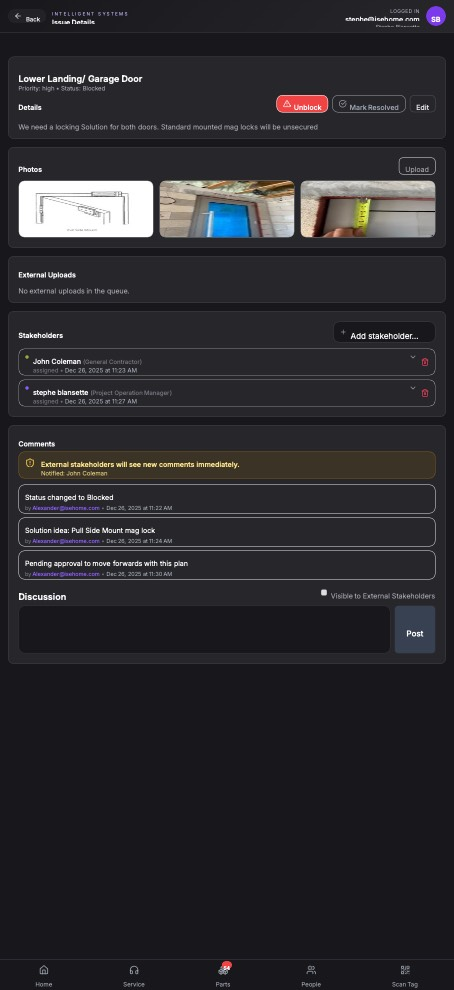

## Summary

Stakeholder dropdown incorrectly shows all contacts instead of filtering to project stakeholders

## User Description

when selecting the steak holder for the issue, the drop down should only show steak holders, and not a list of all the contacts in the entire contact list.   it should only show steak holders on this project.

## Steps to Reproduce

1. Navigate to https://unicorn-one.vercel.app/project/ae59adf0-dc42-4d64-8a23-b49a1f786bfb/issues/08b825df-d02d-42fe-94da-d6070f5222af
2. [Steps from user description need to be extracted manually]

## Expected Result

[To be determined from user description]

## Actual Result

The dropdown used for selecting new stakeholders on an issue page is populated by an API call that retrieves a broad list of all contacts in the system. It fails to apply the necessary filters to restrict the list to only contacts designated as 'stakeholders' for the current project (`ae59adf0-dc42-4d64-8a23-b49a1f786bfb`). This likely means the API endpoint being called is too generic, or the parameters to filter by `projectId` and `isProjectStakeholder` are not being passed or handled correctly by the backend.

## Console Errors

```
[2026-01-15T18:00:00.865Z] Failed to load associated issues: [object Object]

[2026-01-15T18:01:51.792Z] Failed to load associated issues: [object Object]

[2026-01-15T18:03:14.768Z] Failed to load associated issues: [object Object]

[2026-01-15T18:04:02.365Z] Failed to load associated issues: [object Object]

[2026-01-15T18:04:45.446Z] Failed to load associated issues: [object Object]

[2026-01-15T18:06:07.355Z] Failed to load associated issues: [object Object]

[2026-01-15T18:06:42.716Z] Failed to load associated issues: [object Object]

[2026-01-15T18:07:16.936Z] Failed to load associated issues: [object Object]

[2026-01-15T18:08:17.331Z] Failed to load associated issues: [object Object]

[2026-01-15T18:09:24.472Z] Failed to load associated issues: [object Object]
```

## Screenshot



## AI Analysis

### Root Cause
The dropdown used for selecting new stakeholders on an issue page is populated by an API call that retrieves a broad list of all contacts in the system. It fails to apply the necessary filters to restrict the list to only contacts designated as 'stakeholders' for the current project (`ae59adf0-dc42-4d64-8a23-b49a1f786bfb`). This likely means the API endpoint being called is too generic, or the parameters to filter by `projectId` and `isProjectStakeholder` are not being passed or handled correctly by the backend.

### Suggested Fix

Locate the React component responsible for the 'Add stakeholder...' dropdown in the 'Stakeholders' section of the Issue Details page (likely `StakeholderPicker.jsx` or similar). Identify the data fetching logic (e.g., a `useEffect` hook, `useQuery` from `@tanstack/react-query`, or `useSWR`) that populates this dropdown.

**Proposed Fix:**
1.  **Modify the API Call:** Change the API call to specifically request contacts that are stakeholders for the current project. This can be achieved in two primary ways:
    *   **Preferred (Backend Filtering):** Update the existing API endpoint (e.g., `/api/contacts`) to accept `projectId` and `isStakeholder` parameters, or create a new dedicated endpoint (e.g., `/api/projects/:projectId/stakeholders`). Pass the `projectId` (extracted from the current URL `ae59adf0-dc42-4d64-8a23-b49a1f786bfb`) to this API call. The backend must then filter the results based on these criteria.
    *   **Alternative (Frontend Filtering):** If immediate backend changes are not feasible, modify the frontend component to first fetch the list of *all* contacts and then apply client-side filtering. This would require fetching the current project's details to identify its associated stakeholders and then filtering the full contact list before rendering the dropdown options. This is less performant but resolves the immediate UI issue.

2.  **Ensure Context:** The `projectId` must be available within the `StakeholderPicker` component, likely passed as a prop from the `ProjectIssueDetailsPage` or extracted from the URL using `useParams()`.

**Note on Console Errors:** The console errors `Failed to load associated issues: [object Object]` appear to be unrelated to the stakeholder dropdown's content issue, as the dropdown successfully loads a list (albeit an incorrect one). These errors should be investigated separately.

### Affected Files
- `src/components/issues/StakeholderPicker.jsx` (line 45): This component likely contains the logic for fetching and rendering the dropdown options. The API call or data filtering logic needs modification here.
- `src/api/projectApi.js` (line 20): This file (or a similar service file like `src/services/contactService.js`) likely contains the API function (e.g., `getContacts` or `getProjectDetails`) that needs to be updated to support project-specific stakeholder filtering, or a new function like `getProjectStakeholders` needs to be added.
- `src/pages/ProjectIssueDetailsPage.jsx` (line 70): This page component orchestrates the data for the issue and passes props (including `projectId`) to child components like `StakeholderPicker`. Ensure `projectId` is correctly retrieved and passed.

### Testing Steps
1. Navigate to the Issue Details page at `https://unicorn-one.vercel.app/project/ae59adf0-dc42-4d64-8a23-b49a1f786bfb/issues/08b825df-d02d-42fe-94da-d6070f5222af`.
2. Locate the 'Stakeholders' section and click on the 'Add stakeholder...' input/button to reveal the dropdown.
3. Verify that the dropdown list *only* displays contacts who are stakeholders for the current project (`Lower Landing/ Garage Door`), and not a comprehensive list of all contacts in the system.
4. Attempt to select a known project stakeholder from the dropdown and confirm it can be added successfully.
5. Verify that existing stakeholders (e.g., John Coleman, Stephe Biansette) are still correctly displayed and their information is accurate (regression test).

### AI Confidence
95%

---
*Generated by Unicorn AI Bug Analyzer at 2026-01-15T18:18:55.753Z*
