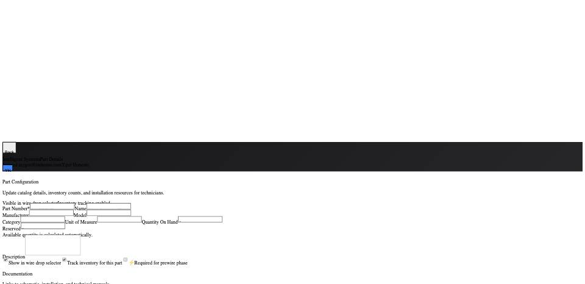

## Summary

Part configuration fields become blank after a failed attempt to save edits.

## User Description

When saving edits to a pending part the fields become blank.

## Steps to Reproduce

1. Navigate to https://unicorn-one.vercel.app/parts/4f26496f-63c4-47e6-bbb0-3256382be77e
2. [Steps from user description need to be extracted manually]

## Expected Result

[To be determined from user description]

## Actual Result

The API call to update the part configuration fails, as indicated by the console error 'Failed to update part: [object Object]'. Instead of retaining the user's input and displaying an error message, the React component responsible for the form submission incorrectly clears or resets the form fields' state upon this failure. The error logging itself is also insufficient, only showing `[object Object]` instead of detailed error information.

## Console Errors

```
[2026-01-16T18:35:45.721Z] Failed to update part: [object Object]
```

## Screenshot



## AI Analysis

### Root Cause
The API call to update the part configuration fails, as indicated by the console error 'Failed to update part: [object Object]'. Instead of retaining the user's input and displaying an error message, the React component responsible for the form submission incorrectly clears or resets the form fields' state upon this failure. The error logging itself is also insufficient, only showing `[object Object]` instead of detailed error information.

### Suggested Fix

Locate the form submission handler (likely an `async` function such as `handleSubmit` or `handleSave`) within the `PartDetailsPage` component or a related part form component. 

1.  **Enhance Error Logging:** Inside the `catch` block of the `try...catch` statement that wraps the API call to update the part (e.g., `partsService.updatePart(partId, updatedPartData)`), update the `console.error` to log more specific details from the error object. For example, log `error.message`, `error.response?.data`, and `error.response?.status` to provide better context for debugging API failures.

2.  **Prevent Unconditional State Reset:** Identify and remove any code within the `catch` block, `finally` block, or any subsequent logic that is executed on an unsuccessful save operation, which might clear or reset the form fields' state (e.g., `setFormData({})`, `setFormData(initialState)`, or an unconditional `refetch` that would then display an empty state). The form should retain the user's most recent attempted input if the save fails.

3.  **Display User Feedback:** Implement a user-facing error notification (e.g., a toast message, an alert, or an inline error message) within the `catch` block to clearly inform the user that the save operation failed and to suggest they try again.

### Affected Files
- `src/features/parts/PartDetailsPage.js` (line 1): This component is the most likely candidate to contain the form rendering and submission logic for updating a specific part. The `handleSubmit` or `handleSave` function, along with its `try...catch` block for API calls, should be modified.
- `src/services/partsService.js` (line 1): While the UI issue is in the frontend, reviewing the `updatePart` function here can ensure it consistently throws appropriate errors for the frontend to catch, if it doesn't already.

### Testing Steps
1. 1. Navigate to the Part Details page (e.g., https://unicorn-one.vercel.app/parts/4f26496f-63c4-47e6-bbb0-3256382be77e).
2. 2. Make modifications to one or more fields in the 'Part Configuration' form (e.g., change 'Name' or 'Quantity On Hand').
3. 3. Trigger an API save failure (e.g., by blocking the network request for the update operation in the browser's developer tools or by submitting invalid data if backend validation is in place).
4. 4. Verify that the form fields *do not* become blank and instead retain the values the user attempted to save.
5. 5. Verify that an informative error message is displayed to the user on screen.
6. 6. Perform a successful save operation with valid data to ensure that the fix hasn't introduced regressions and that fields update and persist correctly.

### AI Confidence
95%

---
*Generated by Unicorn AI Bug Analyzer at 2026-01-16T18:43:07.653Z*
