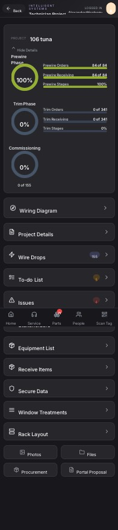

## Summary

The application fails to load the equipment list for a project, likely causing the user to perceive missing data or functionality.

## User Description

Feature request 

General notes

## Steps to Reproduce

1. Navigate to https://unicorn-one.vercel.app/project/ae59adf0-dc42-4d64-8a23-b49a1f786bfb
2. [Steps from user description need to be extracted manually]

## Expected Result

[To be determined from user description]

## Actual Result

The application's attempt to fetch equipment data from the API failed, resulting in a `Failed to fetch equipment: [object Object]` error. This prevents the 'Equipment List' section from populating with data. The `[object Object]` in the error message suggests an unhandled or improperly logged error during the API call or response processing. A secondary error, `Error calculating prewire receiving percentage`, indicates potential issues with data validation or calculation logic for project metrics.

## Console Errors

```
[2026-01-23T18:21:36.909Z] Error calculating prewire receiving percentage: [object Object]

[2026-01-23T18:23:10.761Z] Failed to fetch equipment: [object Object]
```

## Screenshot



## AI Analysis

### Root Cause
The application's attempt to fetch equipment data from the API failed, resulting in a `Failed to fetch equipment: [object Object]` error. This prevents the 'Equipment List' section from populating with data. The `[object Object]` in the error message suggests an unhandled or improperly logged error during the API call or response processing. A secondary error, `Error calculating prewire receiving percentage`, indicates potential issues with data validation or calculation logic for project metrics.

### Suggested Fix

To address the 'Failed to fetch equipment' error, locate the component or hook responsible for fetching project equipment data (e.g., `EquipmentList.jsx` or `useProjectEquipment.js` within `src/features/projects/`).

1.  **Improve API Call Error Handling:** Within the data fetching logic (e.g., `useEffect` or an async function), ensure that the `try...catch` block properly handles errors. Specifically, log the actual error message and potentially the response body from the API.
    *   **Example (Fetch API):**
        javascript
        try {
            const response = await fetch(`/api/projects/${projectId}/equipment`);
            if (!response.ok) {
                const errorData = await response.json();
                throw new Error(`API error: ${response.status} - ${errorData.message || JSON.stringify(errorData)}`);
            }
            const data = await response.json();
            // ... process data
        } catch (error) {
            console.error('Failed to fetch equipment:', error.message || error);
            // Set state to display an error message in the UI
            setError('Failed to load equipment data. Please try again.');
        }
        
    *   **Example (Axios):**
        javascript
        try {
            const response = await axios.get(`/api/projects/${projectId}/equipment`);
            // ... process response.data
        } catch (error) {
            console.error('Failed to fetch equipment:', error.message);
            if (error.response) {
                console.error('API Response Error:', error.response.status, error.response.data);
                setError(`Failed to load equipment: ${error.response.data.message || 'Server error'}`);
            } else if (error.request) {
                console.error('Network Error:', error.request);
                setError('Network error. Please check your connection.');
            } else {
                setError('An unexpected error occurred.');
            }
        }
        

2.  **Display Error in UI:** Implement UI feedback within the `EquipmentList` component to inform the user when data fails to load (e.g., 'Unable to load equipment data' message or a retry button).

3.  **Investigate API Endpoint:** Coordinate with the backend team to ensure the `/api/projects/{projectId}/equipment` endpoint is operational and returning valid data. The `[object Object]` suggests the backend might be returning an unexpected error format or the client isn't parsing it correctly.

For the 'Error calculating prewire receiving percentage', review the calculation logic in the component displaying project phase summaries (e.g., `ProjectSummary.jsx`). Ensure all values used in the calculation are validated (e.g., check for `null`, `undefined`, or non-numeric types) before performing arithmetic operations. Add more specific logging to identify which specific value is causing the calculation to fail.

### Affected Files
- `src/features/projects/components/EquipmentList.jsx`: Component responsible for displaying the equipment list. This file likely contains the data fetching logic or calls a hook that fetches the data. Error handling should be improved here.
- `src/features/projects/hooks/useProjectEquipment.js`: If a custom hook is used for fetching equipment data, the API call and error handling should be reviewed and improved in this file.
- `src/features/projects/components/ProjectSummary.jsx`: Component displaying project phase percentages. The calculation logic for 'prewire receiving percentage' should be reviewed for data validation and error handling.

### Testing Steps
1. Navigate to the project page: `https://unicorn-one.vercel.app/project/ae59adf0-dc42-4d64-8a23-b49a1f786bfb`.
2. Verify that the 'Equipment List' section now loads correctly and displays expected data.
3. If the API can be made to intentionally fail (e.g., by changing the project ID to a non-existent one), verify that an appropriate error message is displayed in the UI for the Equipment List.
4. Verify that the 'Prewire Receiving' percentage is calculated and displayed correctly and that no related console errors appear.

### AI Confidence
80%

---
*Generated by Unicorn AI Bug Analyzer at 2026-01-23T18:27:21.657Z*
