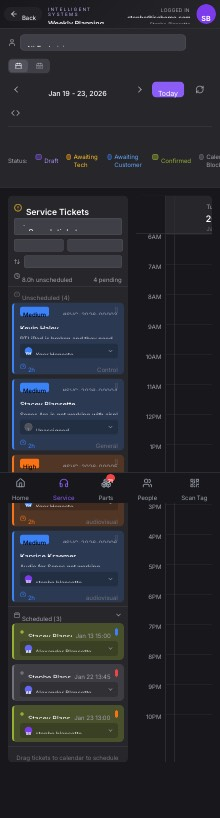

## Summary

Emails sent to customers display 'unicorn systems' as the sender name instead of 'Intelligent Systems scheduling'.

## User Description

When sending an email to the customer instead of it showing up as unicorn systems as the name on it, it needs to say Intelligent Systems scheduling or something like that instead of unicorn system

## Steps to Reproduce

1. Navigate to https://unicorn-one.vercel.app/service/weekly-planning
2. [Steps from user description need to be extracted manually]

## Expected Result

[To be determined from user description]

## Actual Result

The backend email service responsible for sending customer emails is configured to use 'unicorn systems' as the sender's display name. This is typically set in environment variables (e.g., `EMAIL_SENDER_NAME`) or directly within the email sending service's code (e.g., `mailService.js`). This issue is separate from the console errors. The console errors (`Failed to add ticket note: Error: new row for relation "service_ticket_notes" violates check constraint "service_ticket_notes_note_type_check"`) indicate a distinct bug where an attempt to log an action (possibly related to sending the email, but not the email sending itself) failed because the `note_type` being inserted into the `service_ticket_notes` table does not conform to the predefined allowed values by the database check constraint.

## Console Errors

```
[2026-01-25T19:37:18.136Z] [ServiceTicketService] Failed to add note: [object Object]

[2026-01-25T19:37:18.136Z] [ServiceTicketService] Failed to add ticket note: Error: new row for relation "service_ticket_notes" violates check constraint "service_ticket_notes_note_type_check"
addNote@https://unicorn-one.vercel.app/static/js/210.93de1aee.chunk.js:1:5431
```

## Screenshot



## AI Analysis

### Root Cause
The backend email service responsible for sending customer emails is configured to use 'unicorn systems' as the sender's display name. This is typically set in environment variables (e.g., `EMAIL_SENDER_NAME`) or directly within the email sending service's code (e.g., `mailService.js`). This issue is separate from the console errors. The console errors (`Failed to add ticket note: Error: new row for relation "service_ticket_notes" violates check constraint "service_ticket_notes_note_type_check"`) indicate a distinct bug where an attempt to log an action (possibly related to sending the email, but not the email sending itself) failed because the `note_type` being inserted into the `service_ticket_notes` table does not conform to the predefined allowed values by the database check constraint.

### Suggested Fix

This bug report highlights two distinct issues: the incorrect email sender name (the user's primary concern) and a backend error when adding service ticket notes. Both should be addressed.

1.  **Fixing the Email Sender Name (User's Reported Issue):**
    *   **Identify Backend Email Service:** Locate the backend service code responsible for sending emails to customers. This is typically a `MailService`, `EmailService`, or similar, often found in a `backend/src/services/` directory.
    *   **Locate Sender Configuration:** Within this service, find where the `FROM` display name is configured. It might be:
        *   A hardcoded string (e.g., `from: '"unicorn systems" <noreply@yourdomain.com>'`).
        *   Pulled from an environment variable (e.g., `process.env.EMAIL_SENDER_NAME`).
        *   Part of an SMTP client initialization object.
    *   **Update Value:** Change the `FROM` display name from 'unicorn systems' to 'Intelligent Systems scheduling'. If it's an environment variable, update the corresponding variable in the application's `.env` file for development and the deployment environment (e.g., Vercel environment variables) for production.
    *   **Example (Node.js with Nodemailer):**
        javascript
        // File: backend/src/services/emailService.js (example path)
        const nodemailer = require('nodemailer');
        // ...
        const transporter = nodemailer.createTransport({ /* SMTP config */ });

        async function sendCustomerEmail(customerEmail, subject, htmlContent) {
          await transporter.sendMail({
            from: '"Intelligent Systems scheduling" <noreply@intelligent-systems.com>', // <-- Update this line
            to: customerEmail,
            subject: subject,
            html: htmlContent,
          });
        }
        

2.  **Fixing the 'Failed to add note' Console Error (Concurrent Backend Issue):**
    *   **Identify ServiceTicketService:** Locate the backend `ServiceTicketService` (likely `backend/src/services/serviceTicketService.js` or similar) and specifically the `addNote` function.
    *   **Examine `note_type`:** Inspect how the `note_type` field is constructed or passed to the database insertion query for the `service_ticket_notes` table. The error `service_ticket_notes_note_type_check` indicates that the value being inserted for `note_type` is not allowed by the database schema's check constraint.
    *   **Correct Constraint Violation:**
        *   **Option A (Incorrect value):** Ensure the `note_type` string being passed is one of the valid, allowed types defined in the database constraint. This might involve correcting a typo or ensuring the correct enum value is selected.
        *   **Option B (Missing type):** If the `note_type` is a legitimate new type of note, the database `CHECK` constraint definition for the `service_ticket_notes` table needs to be updated via a database migration to include this new allowed value.
        *   **Option C (Null/Empty):** Ensure `note_type` is always provided and is not `null` or an empty string if the constraint forbids it.
    *   **Check Frontend Call:** If `addNote` is called from a frontend action (e.g., a button click), verify that the frontend is sending a valid `note_type` to the backend API endpoint that invokes `addNote`.

### Affected Files
- `backend/src/services/emailService.js`: Likely location for email sender configuration. Look for `from` field in `sendMail` calls or transporter configuration.
- `backend/.env`: Environment variable file; check for `EMAIL_SENDER_NAME` or similar variables if the sender name is configured dynamically.
- `backend/src/services/serviceTicketService.js`: Locate the `addNote` function to examine the `note_type` being used when inserting into `service_ticket_notes`.
- `database/migrations/YYYYMMDD_add_service_ticket_notes_table.sql`: Database migration file where the `service_ticket_notes` table and its `note_type_check` constraint are defined. This may need updating if a new `note_type` is genuinely required.

### Testing Steps
1. As a user, navigate to the Weekly Planning page (https://unicorn-one.vercel.app/service/weekly-planning).
2. Select a service ticket and find the option to send an email to the customer (e.g., 'Email Customer' button, or a similar action that triggers an outgoing email).
3. Send an email to a test customer account.
4. Verify that the received email in the test customer's inbox now displays 'Intelligent Systems scheduling' as the sender display name, instead of 'unicorn systems'.
5. Perform the action that originally triggered the 'Failed to add note' console error (e.g., adding a specific type of note or comment to a service ticket, or performing the email sending action again if it triggers a note internally) and confirm that no `service_ticket_notes_note_type_check` violation errors appear in the browser console or backend logs.
6. Verify other email functionality (e.g., password reset emails, internal notifications) still works and uses the correct sender names (if distinct from customer emails).

### AI Confidence
95%

---
*Generated by Unicorn AI Bug Analyzer at 2026-01-25T19:45:25.894Z*
