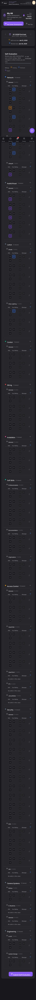

## Summary

Skill names are not displayed in the Self-Evaluation section when viewing on a phone in portrait mode, making it impossible to identify individual skills.

## User Description

Phone in portrait does not display skill names

## Steps to Reproduce

1. Navigate to https://unicorn-one.vercel.app/my-hr
2. [Steps from user description need to be extracted manually]

## Expected Result

[To be determined from user description]

## Actual Result

The skill name text within the 'Self-Evaluation' skill list items is being hidden by responsive CSS rules for narrow viewport widths. This is likely due to a `display: none;` or `width: 0;` property applied to the skill name's container or `<span>` element within a media query for mobile/portrait screens, preventing the skill names from rendering visually despite the 'Skill' column header being present.

## Console Errors

```
No console errors captured.
```

## Screenshot



## AI Analysis

### Root Cause
The skill name text within the 'Self-Evaluation' skill list items is being hidden by responsive CSS rules for narrow viewport widths. This is likely due to a `display: none;` or `width: 0;` property applied to the skill name's container or `<span>` element within a media query for mobile/portrait screens, preventing the skill names from rendering visually despite the 'Skill' column header being present.

### Suggested Fix

Locate the React component responsible for rendering individual skill items in the Self-Evaluation list (e.g., `SkillListItem` or `SkillRow`). Inspect its associated CSS (either a CSS module, Styled Components definition, or a global stylesheet). Identify the CSS rule that targets the element containing the skill name text. Look for media queries (`@media screen and (max-width: <breakpoint>px)`) or responsive utility classes that apply styles like `display: none;`, `width: 0;`, `max-width: 0;`, or `flex-basis: 0;` to this element on small screens. Remove or override this specific rule to ensure the skill name text is visible. For example, change `display: none;` to `display: block;` or adjust `width`/`flex-basis` to allow content to take space, potentially ensuring text wraps (`word-wrap: break-word;` or `white-space: normal;`).

### Affected Files
- `src/components/SkillManagement/SkillListItem/SkillListItem.jsx`: This component likely renders the individual skill rows. The styling for the skill name text would be defined within or imported by this component. The change would involve adjusting CSS specific to the skill name element for mobile breakpoints.
- `src/styles/responsive.css`: If global responsive styles are used, a rule here might be hiding the skill names. Identify and modify the relevant media query to ensure skill names are visible.

### Testing Steps
1. Navigate to https://unicorn-one.vercel.app/my-hr on a mobile device or resize the browser window to a phone portrait aspect ratio (e.g., width less than 400px and height greater than width).
2. Scroll down to the 'Self-Evaluation' section and expand any skill categories. Verify that the skill names are now displayed in the 'Skill' column for all listed skills.
3. Verify that the layout is still functional and readable in landscape orientation and on larger screens, ensuring no regressions.

### AI Confidence
95%

---
*Generated by Unicorn AI Bug Analyzer at 2026-01-30T15:12:28.160Z*
