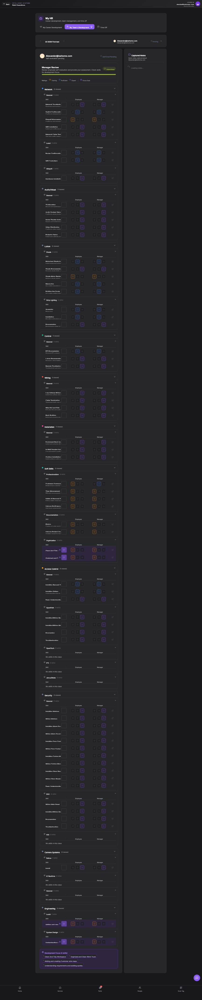

## Summary

Users cannot add or modify 'Development Focus' areas after a manager review has been submitted, as the section becomes locked.

## User Description

I need to be able to make changes after a review has been submitted if I want to add other focus areas so those shouldn't be locked down at any particular time

## Steps to Reproduce

1. Navigate to https://unicorn-one.vercel.app/my-hr
2. [Steps from user description need to be extracted manually]

## Expected Result

[To be determined from user description]

## Actual Result

The application's UI logic is currently configured to make the 'Development Focus' section (and likely other input elements) read-only or disabled when a manager review's status is 'Submitted'. This is due to a global `isSubmitted` state or prop dictating the editability of the entire review form, instead of allowing granular control for specific sections like 'Development Focus'. The user expects to be able to make changes to focus areas even after the initial submission.

## Console Errors

```
No console errors captured.
```

## Screenshot



## AI Analysis

### Root Cause
The application's UI logic is currently configured to make the 'Development Focus' section (and likely other input elements) read-only or disabled when a manager review's status is 'Submitted'. This is due to a global `isSubmitted` state or prop dictating the editability of the entire review form, instead of allowing granular control for specific sections like 'Development Focus'. The user expects to be able to make changes to focus areas even after the initial submission.

### Suggested Fix

1.  **Locate the relevant component:** Identify the React component responsible for rendering the 'Development Focus' section within the manager review form. Based on the page URL and context, this component is likely part of the HR module, possibly named `ManagerReviewForm.js`, `ReviewDetails.js`, `DevelopmentFocusEditor.js`, or similar, located in `src/features/hr/components/` or `src/pages/myhr/`. 
2.  **Adjust editability logic:** Find where the 'Development Focus' input elements (e.g., a tag input component, 'add' button for focus areas) receive their `disabled` or `readOnly` prop. This prop is currently being set to `true` (or the input component is not rendered) when the overall `review.status` is 'Submitted'.
3.  **Modify the condition:** Change the condition so that the 'Development Focus' section specifically remains editable even if the `review.status` is 'Submitted'. For example, if there's a prop like `isEditable`, modify it from `isEditable={review.status !== 'Submitted'}` to `isEditable={true}` specifically for the focus area section, or introduce a new prop like `allowFocusAreaEdit={true}`.
4.  **Ensure save functionality:** Verify that modifying focus areas after submission triggers an appropriate API call to update only these specific fields. If the form's main 'Submit' button becomes disabled after submission, ensure there's a separate mechanism or an 'Update Focus Areas' button that remains enabled to persist these changes.

### Affected Files
- `src/features/hr/components/ManagerReviewForm.js`: This file likely contains the main review form structure. You'll need to locate the `DevelopmentFocus` sub-component and its props.
- `src/features/hr/components/DevelopmentFocusEditor.js`: If 'Development Focus' is a separate component, its internal logic for determining editability based on a `reviewStatus` prop will need adjustment. Ensure its input fields/buttons are not `disabled` or `readOnly` if the `reviewStatus` is 'Submitted'.
- `src/api/reviews.js`: Potentially, if a separate API endpoint or logic is needed to handle partial updates for 'focus areas' after a review has been initially submitted.

### Testing Steps
1. Navigate to 'My HR' -> 'My Team's Development'.
2. Select an employee's review that is in a 'Draft' or 'Pending' state.
3. Add one or more 'Development Focus' areas and submit the review.
4. Verify the review status changes to 'Submitted' (green badge).
5. Attempt to add new 'Development Focus' areas, edit existing ones, or remove them within the now 'Submitted' review.
6. Verify that the input fields and controls for 'Development Focus' are enabled and allow modifications.
7. Make a change (e.g., add a new focus area) and ensure it can be saved/persisted. Reload the page to confirm the updated focus areas are displayed.
8. Verify that other parts of the manager review (e.g., skill ratings) remain locked and non-editable, if that is the intended behavior post-submission.

### AI Confidence
90%

---
*Generated by Unicorn AI Bug Analyzer at 2026-01-31T00:18:33.852Z*
