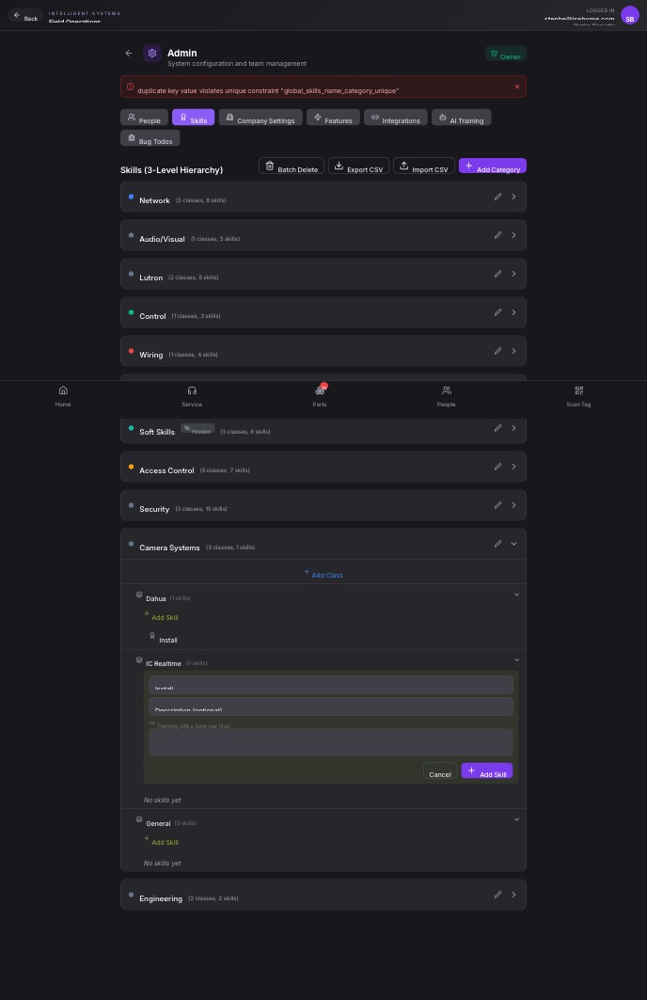

## Summary

Cannot create duplicate skill names under different classes within the same top-level category due to an incorrect database uniqueness constraint.

## User Description

Some skill names can’t be duplicated even when under a different section or category

## Steps to Reproduce

1. Navigate to https://unicorn-one.vercel.app/admin
2. [Steps from user description need to be extracted manually]

## Expected Result

[To be determined from user description]

## Actual Result

The application's database schema enforces a unique constraint, `global_skills_name_category_unique`, on the combination of a skill's name and its top-level category name (e.g., 'Install' + 'Camera Systems'). The user's expectation, however, is that a skill name should only be unique within its immediate parent class (e.g., 'Install' + 'Dahua' vs 'Install' + 'IC Realtime'). This mismatch prevents adding skills with the same name under different classes if those classes belong to the same overarching category.

## Console Errors

```
No console errors captured.
```

## Screenshot



## AI Analysis

### Root Cause
The application's database schema enforces a unique constraint, `global_skills_name_category_unique`, on the combination of a skill's name and its top-level category name (e.g., 'Install' + 'Camera Systems'). The user's expectation, however, is that a skill name should only be unique within its immediate parent class (e.g., 'Install' + 'Dahua' vs 'Install' + 'IC Realtime'). This mismatch prevents adding skills with the same name under different classes if those classes belong to the same overarching category.

### Suggested Fix

The fix involves updating the database schema to change the uniqueness constraint for skill names. The current constraint is too broad, linking skill names to top-level categories instead of their immediate parent classes. 

1.  **Locate Database Migration Files:** Identify the relevant database migration file(s) or ORM model definition for the `skills` table (and potentially `classes` and `categories` tables if they are implicitly involved in the `global_skills_name_category_unique` constraint).
    *   Likely candidates for schema definitions: `src/database/migrations/*`, `src/models/skill.js`, `src/models/class.js` if an ORM like Sequelize, TypeORM, or Prisma is used.
2.  **Remove Existing Unique Constraint:** Drop the `global_skills_name_category_unique` constraint from the `skills` table. This constraint is causing the issue by enforcing uniqueness at the category level.
    *   **SQL Example:** `ALTER TABLE skills DROP CONSTRAINT global_skills_name_category_unique;`
3.  **Add New Unique Constraint:** Add a new unique constraint to the `skills` table that enforces uniqueness on the combination of `name` and `class_id` (the foreign key linking skills to their parent classes).
    *   **SQL Example:** `ALTER TABLE skills ADD CONSTRAINT unique_skill_name_per_class UNIQUE (name, class_id);`
    *   **ORM Example (e.g., Sequelize in `src/models/skill.js`):** Modify the `Skill` model definition to include an index for uniqueness:
        javascript
        // ... inside Skill.init options object
        indexes: [
          {
            unique: true,
            fields: ['name', 'class_id'], // Enforce uniqueness per class
            name: 'unique_skill_name_per_class' // Optional: provide a name
          }
        ]
        
4.  **Review API Validation (Optional but Recommended):** Check the backend API endpoint responsible for creating skills (`POST /api/skills`). If there's any application-level validation that duplicates the previous database constraint, update it to align with the new `(name, class_id)` uniqueness rule. This might be in a service layer, controller, or DTO validation file (e.g., `src/api/skills/skill.service.js`, `src/api/skills/skill.controller.js`, `src/validation/skill.schema.js`).

Ensure that `class_id` is a valid foreign key on the `skills` table, correctly linking each skill to its parent class.

### Affected Files
- `src/database/migrations/add_skill_name_class_unique_constraint.js`: Create a new database migration file to remove the old unique constraint and add the new one (skill name unique per class_id).
- `src/models/skill.js`: If an ORM is used, update the Skill model definition to reflect the new unique index on (name, class_id) and remove any reference to the old constraint.
- `src/api/skills/skill.service.js`: Review and update any application-level validation logic for skill creation/update to check for uniqueness within the class, if such validation exists.

### Testing Steps
1. Navigate to the Admin > Skills page (https://unicorn-one.vercel.app/admin).
2. Under 'Camera Systems', ensure there is a Class 'Dahua' with a skill named 'Install'.
3. Under 'Camera Systems', locate the Class 'IC Realtime'. Open the 'Add Skill' form for 'IC Realtime'.
4. Enter 'Install' as the skill name and attempt to add the skill. The operation should now succeed without a 'duplicate key' error.
5. To verify the new constraint, attempt to add 'Install' again under the 'IC Realtime' class. This operation should now correctly fail, indicating that 'Install' already exists within 'IC Realtime'.

### AI Confidence
95%

---
*Generated by Unicorn AI Bug Analyzer at 2026-02-04T10:45:31.931Z*
