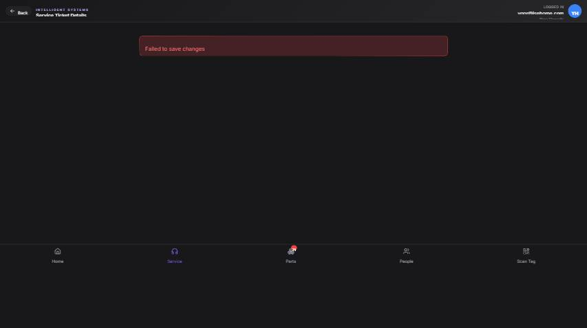

## Summary

User's edits to a service ticket are not saved due to a missing 'service_address' column in the database.

## User Description

Service ticket doesn't save edits.

## Steps to Reproduce

1. Navigate to https://unicorn-one.vercel.app/service/tickets/255750cc-5923-4cdb-b5c6-cbc82b2db53e
2. [Steps from user description need to be extracted manually]

## Expected Result

[To be determined from user description]

## Actual Result

The application's `ServiceTicketService` attempts to update the `service_tickets` table with a column named `service_address`, but this column does not exist in the database schema. This leads to a database-level error propagated back to the frontend, preventing any edits from being saved.

## Console Errors

```
[2026-02-05T16:36:52.430Z] Fallback count also failed: [object Object]

[2026-02-05T16:48:47.692Z] [ServiceTicketService] Failed to update ticket: [object Object]

[2026-02-05T16:48:47.694Z] [ServiceTicketService] Failed to update service ticket: Error: Could not find the 'service_address' column of 'service_tickets' in the schema cache
Error: Could not find the 'service_address' column of 'service_tickets' in the schema cache
    at Object.update (https://unicorn-one.vercel.app/static/js/210.8a628fed.chunk.js:1:4118)
    at async onClick (https://unicorn-one.vercel.app/static/js/3985.374cd56a.chunk.js:2:113688)

[2026-02-05T16:48:47.694Z] [ServiceTicketDetail] Failed to save edits: Error: Could not find the 'service_address' column of 'service_tickets' in the schema cache
Error: Could not find the 'service_address' column of 'service_tickets' in the schema cache
    at Object.update (https://unicorn-one.vercel.app/static/js/210.8a628fed.chunk.js:1:4118)
    at async onClick (https://unicorn-one.vercel.app/static/js/3985.374cd56a.chunk.js:2:113688)

[2026-02-05T16:49:28.052Z] [ServiceTicketService] Failed to update ticket: [object Object]

[2026-02-05T16:49:28.052Z] [ServiceTicketService] Failed to update service ticket: Error: Could not find the 'service_address' column of 'service_tickets' in the schema cache
Error: Could not find the 'service_address' column of 'service_tickets' in the schema cache
    at Object.update (https://unicorn-one.vercel.app/static/js/210.8a628fed.chunk.js:1:4118)
    at async onClick (https://unicorn-one.vercel.app/static/js/3985.374cd56a.chunk.js:2:113688)

[2026-02-05T16:49:28.052Z] [ServiceTicketDetail] Failed to save edits: Error: Could not find the 'service_address' column of 'service_tickets' in the schema cache
Error: Could not find the 'service_address' column of 'service_tickets' in the schema cache
    at Object.update (https://unicorn-one.vercel.app/static/js/210.8a628fed.chunk.js:1:4118)
    at async onClick (https://unicorn-one.vercel.app/static/js/3985.374cd56a.chunk.js:2:113688)

[2026-02-05T17:27:18.645Z] [ServiceTicketService] Failed to update ticket: [object Object]

[2026-02-05T17:27:18.645Z] [ServiceTicketService] Failed to update service ticket: Error: Could not find the 'service_address' column of 'service_tickets' in the schema cache
Error: Could not find the 'service_address' column of 'service_tickets' in the schema cache
    at Object.update (https://unicorn-one.vercel.app/static/js/210.8a628fed.chunk.js:1:4118)
    at async onClick (https://unicorn-one.vercel.app/static/js/3985.374cd56a.chunk.js:2:113688)

[2026-02-05T17:27:18.645Z] [ServiceTicketDetail] Failed to save edits: Error: Could not find the 'service_address' column of 'service_tickets' in the schema cache
Error: Could not find the 'service_address' column of 'service_tickets' in the schema cache
    at Object.update (https://unicorn-one.vercel.app/static/js/210.8a628fed.chunk.js:1:4118)
    at async onClick (https://unicorn-one.vercel.app/static/js/3985.374cd56a.chunk.js:2:113688)
```

## Screenshot



## AI Analysis

### Root Cause
The application's `ServiceTicketService` attempts to update the `service_tickets` table with a column named `service_address`, but this column does not exist in the database schema. This leads to a database-level error propagated back to the frontend, preventing any edits from being saved.

### Suggested Fix

The core issue is a mismatch between the application's data model (expecting `service_address` on `service_tickets`) and the actual database schema. The fix requires either adding the missing column to the database or adjusting the application code to not reference the non-existent column during updates.

1.  **Verify Database Schema:** Connect to the database used by the Unicorn app and inspect the `service_tickets` table. Confirm if a column named `service_address` exists.
    *   **If the `service_address` column is missing (most likely scenario):** A database migration needs to be created and applied to add this column to the `service_tickets` table. The column type (e.g., `VARCHAR(255)`, `TEXT`) and constraints (e.g., `NULL`, `NOT NULL`) should align with the application's intended data storage for service addresses.
        Example SQL for adding the column:
        sql
        ALTER TABLE service_tickets
        ADD COLUMN service_address VARCHAR(255) NULL; -- Adjust type and constraints as necessary
        
    *   **If the `service_address` column should *not* be directly on `service_tickets` (e.g., it was moved to a related `addresses` table, or is a derived field):** The application code responsible for updating service tickets must be modified. Locate the `update` method within `src/services/ServiceTicketService.js` (or similar service layer file). Examine the payload being sent to the backend/database for `service_tickets` and remove any direct references to `service_address` from that payload. If `service_address` is now part of a related entity, ensure the logic to update that related entity is correctly implemented and invoked.

Given the precise error message, adding the missing column to the database is the most probable and direct solution to address 'Could not find the 'service_address' column'.

### Affected Files
- `src/services/ServiceTicketService.js`: This service contains the `update` method that is attempting to save the service ticket edits. It needs to be reviewed to ensure the payload sent to the backend (or direct database interaction) aligns with the database schema. If the column is missing from the DB, this service might be attempting to send data for it. If the column is not meant to be there, this service needs to stop sending it.
- `database/migrations/YYYYMMDD_add_service_address_to_service_tickets.sql`: If the `service_address` column is intended to be on the `service_tickets` table but is missing, a new database migration file is needed to add the column.

### Testing Steps
1. Navigate to a service ticket detail page (e.g., https://unicorn-one.vercel.app/service/tickets/255750cc-5923-4cdb-b5c6-cbc82b2db53e).
2. Make an edit to any editable field on the service ticket.
3. Attempt to save the changes (e.g., by clicking a 'Save' button, if present, or moving focus away from the field).
4. Verify that the 'Failed to save changes' error message no longer appears and the edits are successfully persisted.
5. Refresh the page and confirm the saved edits are still present.

### AI Confidence
95%

---
*Generated by Unicorn AI Bug Analyzer at 2026-02-05T17:30:35.471Z*
