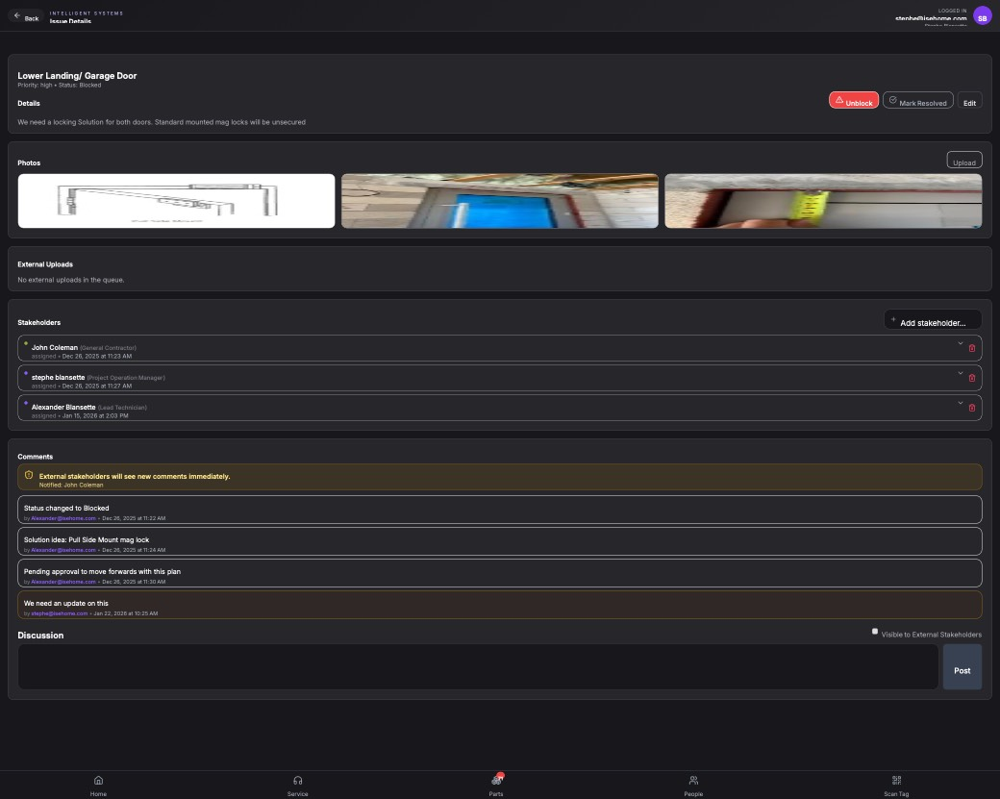

## Summary

Implement 'Notify Stakeholders' email feature and fix MSAL authentication redirect error

## User Description

We need a single button either on an issue or that the issues header that automatically sends an email from the current user out to the stakeholders to let them know that if a stakeholders tagged that they're going to receive an email from the user whoever logged in user is of the particular page in session, but also send unicorn at Isehome.com as a copied entity on the email chain so that unicorn doesn't show up as spam in some of the inbox for our stakeholders. We need to figure out a way to make sure that stakeholders are actually seeing the issues and connecting to the portal so we need a plan that resolves this and it's gotta be pretty thorough so that their email doesn't classify unicorn as junk, but also lets us know that they've actually received it and can connect to it so we need almost some two-way feedback for this. Please note that this is more of a feature request than a bug.

## Steps to Reproduce

1. Navigate to https://unicorn-one.vercel.app/project/ae59adf0-dc42-4d64-8a23-b49a1f786bfb/issues/08b825df-d02d-42fe-94da-d6070f5222af
2. [Steps from user description need to be extracted manually]

## Expected Result

[To be determined from user description]

## Actual Result

The requested 'Notify Stakeholders' feature is currently unimplemented. Furthermore, the MSAL (Microsoft Authentication Library) configuration is failing with a 'hash_empty_error', which prevents the application from acquiring the access tokens necessary to send emails on behalf of the logged-in user via Microsoft Graph API.

## Console Errors

```
[2026-02-09T19:54:53.195Z] [MSAL] [Mon, 09 Feb 2026 19:54:53 GMT] : [019c43f8-976f-754f-b571-4fbc4f32084d] : msal.js.browser@3.30.0 : Error - The request has returned to the redirectUri but a fragment is not present. It's likely that the fragment has been removed or the page has been redirected by code running on the redirectUri page.

[2026-02-09T19:54:53.196Z] [Auth] Token acquisition error: BrowserAuthError: hash_empty_error: Hash value cannot be processed because it is empty. Please verify that your redirectUri is not clearing the hash. For more visit: aka.ms/msaljs/browser-errors
gA@https://unicorn-one.vercel.app/static/js/main.9410b31f.js:2:768308
Xs@https://unicorn-one.vercel.app/static/js/main.9410b31f.js:2:904795
@https://unicorn-one.vercel.app/static/js/main.9410b31f.js:2:783656
silentTokenHelper@https://unicorn-one.vercel.app/static/js/main.9410b31f.js:2:928428
```

## Screenshot



## AI Analysis

### Root Cause
The requested 'Notify Stakeholders' feature is currently unimplemented. Furthermore, the MSAL (Microsoft Authentication Library) configuration is failing with a 'hash_empty_error', which prevents the application from acquiring the access tokens necessary to send emails on behalf of the logged-in user via Microsoft Graph API.

### Suggested Fix

1. Fix MSAL Auth: In the MSAL configuration, ensure the redirectUri is correctly handled and that the React Router (or other routing logic) is not clearing the URL hash before MSAL can process it. This usually involves wrapping the app in MsalProvider and using handleRedirectPromise().
2. UI Implementation: Add a 'Notify Stakeholders' button to the header of the Issue Details page (src/pages/projects/IssueDetails.tsx). 
3. Email Service: Create a service that uses the Microsoft Graph API (/me/sendMail) to send an email. The email must: 
   - Be sent from the current user's account.
   - Include all tagged stakeholders in the 'To' field.
   - CC 'unicorn@isehome.com'.
   - Include a direct link to the issue portal.
4. Tracking/Feedback: Implement a 'two-way feedback' mechanism by appending a unique tracking ID to the portal link in the email. Create a backend endpoint to log when these specific links are clicked to verify stakeholder engagement.

### Affected Files
- `src/authConfig.ts` (line 15): Verify and fix redirectUri and cache settings to prevent hash_empty_error.
- `src/pages/projects/IssueDetails.tsx` (line 45): Add the 'Notify Stakeholders' button to the issue header or actions section.
- `src/services/emailService.ts` (line 1): New service to handle Microsoft Graph API calls for sending emails with the required CC and body logic.

### Testing Steps
1. Log in to the app and verify that no MSAL 'hash_empty_error' appears in the console during the redirect flow.
2. Navigate to an issue with tagged stakeholders.
3. Click the 'Notify Stakeholders' button.
4. Verify that an email is received by the stakeholders from the logged-in user's address.
5. Verify that unicorn@isehome.com is CC'd on the email.
6. Click the link in the email and verify that the system logs the 'feedback' (access event).

### AI Confidence
90%

---
*Generated by Unicorn AI Bug Analyzer at 2026-02-09T20:00:56.192Z*
