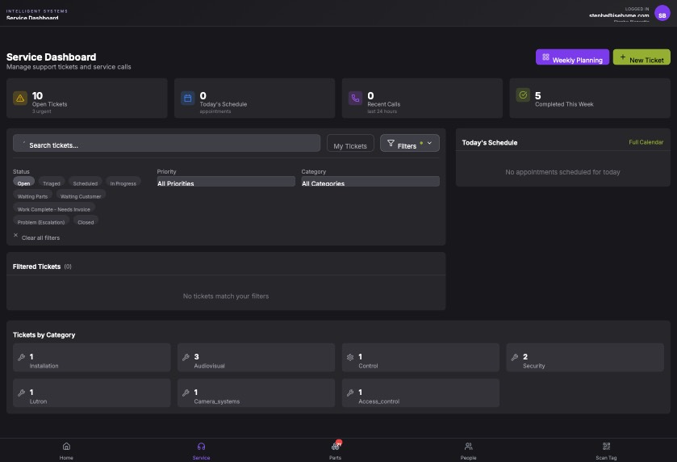

## Summary

Add a 'Show All' button to the 'Tickets by Category' section to allow clearing filters

## User Description

cant unfiltered service tickets.   In the category's area on the bottom  put a show all button

## Steps to Reproduce

1. Navigate to https://unicorn-one.vercel.app/service?status=open
2. [Steps from user description need to be extracted manually]

## Expected Result

[To be determined from user description]

## Actual Result

The 'Tickets by Category' section at the bottom of the Service Dashboard lacks a 'Show All' or 'Clear' option, preventing users from easily resetting filters from that specific UI area as they expect.

## Console Errors

```
No console errors captured.
```

## Screenshot



## AI Analysis

### Root Cause
The 'Tickets by Category' section at the bottom of the Service Dashboard lacks a 'Show All' or 'Clear' option, preventing users from easily resetting filters from that specific UI area as they expect.

### Suggested Fix

In the Service Dashboard, modify the component that renders the 'Tickets by Category' grid (likely `src/components/service/TicketsByCategory.tsx` or within `src/pages/service/index.tsx`). Add a new card/button at the start of the category list labeled 'Show All'. When clicked, this button should clear the active category filter and ideally reset the status filter to 'All' (or clear all query params) to fulfill the user's request to 'unfilter' the tickets. Ensure the 'Show All' card matches the visual style of the existing category cards but perhaps with a distinct icon like a 'list' or 'refresh' icon.

### Affected Files
- `src/pages/service/index.tsx` (line 150): Add a 'Show All' card to the Tickets by Category grid that clears the filter state/URL parameters.

### Testing Steps
1. Navigate to /service?status=open
2. Scroll to the 'Tickets by Category' section at the bottom
3. Verify a 'Show All' card is present
4. Click the 'Show All' card
5. Verify that the URL updates (e.g., removes ?status=open) and the 'Filtered Tickets' list shows all tickets regardless of status or category

### AI Confidence
90%

---
*Generated by Unicorn AI Bug Analyzer at 2026-02-12T00:39:40.438Z*
