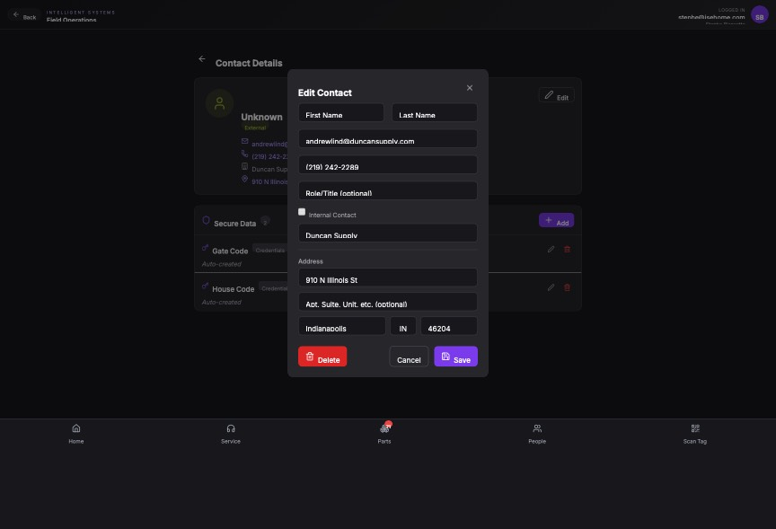

## Summary

Automatically parse full names into first/last fields and add a company/person toggle for contacts

## User Description

When creating this I put in the user's name which was Andrew lynn but it didn't automatically par it in the first name and last name. So we need to make sure that when we're adding contacts, we either automatically parse the names if there's a space there or something like that or some smart way to make sure that we park first and last names into this because otherwise it shows up as an unknown contact. We also need to make sure that we maybe can flag certain contacts as companies versus people so that we can search by the company name as well.

## Steps to Reproduce

1. Navigate to https://unicorn-one.vercel.app/contacts/d36bd9a0-283e-45b3-a09e-a1171c59f089
2. [Steps from user description need to be extracted manually]

## Expected Result

[To be determined from user description]

## Actual Result

The contact form requires manual entry of separate First and Last name fields without auto-splitting full name strings. Additionally, the system lacks a 'Company' vs 'Person' classification, causing contacts with only a company name to display as 'Unknown'.

## Console Errors

```
No console errors captured.
```

## Screenshot



## AI Analysis

### Root Cause
The contact form requires manual entry of separate First and Last name fields without auto-splitting full name strings. Additionally, the system lacks a 'Company' vs 'Person' classification, causing contacts with only a company name to display as 'Unknown'.

### Suggested Fix

1. In the ContactForm component, implement an onBlur handler for the 'First Name' input that checks for spaces; if a space is found and the 'Last Name' field is empty, split the string and populate both fields. 2. Add a 'Contact Type' toggle (Person/Company) to the contact schema and form. 3. Update the contact display logic (e.g., a getDisplayName helper) to prioritize the Company Name if the contact is flagged as a Company or if First/Last names are missing, preventing the 'Unknown' label. 4. Ensure the search functionality includes the company name field.

### Affected Files
- `src/components/contacts/ContactForm.tsx` (line 45): Add name parsing logic to the First Name input and implement a new 'Contact Type' toggle.
- `src/utils/contact-utils.ts` (line 10): Update display name logic to fallback to Company Name before defaulting to 'Unknown'.
- `src/types/contact.ts` (line 5): Add 'type' (person | company) or 'isCompany' boolean to the Contact interface.

### Testing Steps
1. Open the 'Add Contact' or 'Edit Contact' modal.
2. Type 'Andrew Lynn' into the First Name field and press Tab. Verify 'Lynn' is automatically moved to the Last Name field.
3. Toggle the contact type to 'Company'.
4. Leave First/Last name blank but fill in 'Duncan Supply' as the company.
5. Save the contact and verify the header/list shows 'Duncan Supply' instead of 'Unknown'.
6. Search for 'Duncan' in the contact list to ensure company-based searching works.

### AI Confidence
90%

---
*Generated by Unicorn AI Bug Analyzer at 2026-02-12T12:03:32.967Z*
