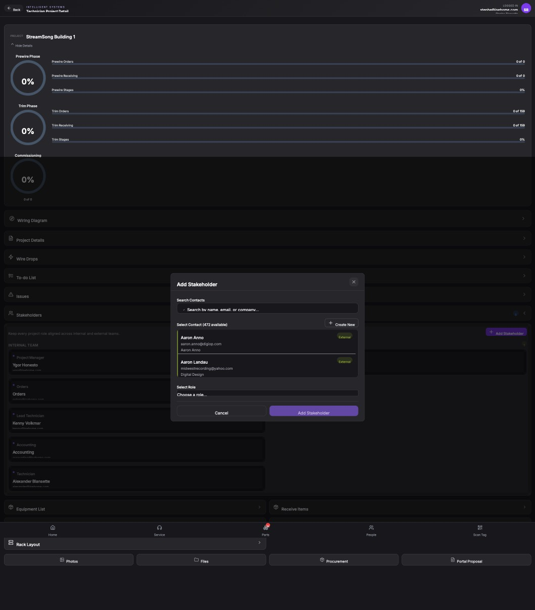

## Summary

Prevent adding stakeholders without a role and display validation message

## User Description

Need to tell user to add role first and cant save without role

## Steps to Reproduce

1. Navigate to https://unicorn-one.vercel.app/project/3c214974-e534-4a0d-a30f-689e840aa85c
2. [Steps from user description need to be extracted manually]

## Expected Result

[To be determined from user description]

## Actual Result

The 'Add Stakeholder' modal lacks frontend validation to ensure a role is selected before submission. The screenshot shows the 'Add Stakeholder' button is active even when the role dropdown displays 'Choose a role...'.

## Console Errors

```
[2026-02-23T20:51:54.775Z] Failed to fetch Lucid data: Error: Missing or malformed Authorization header
@https://unicorn-one.vercel.app/static/js/5763.e12c8b65.chunk.js:1:3093

[2026-02-23T20:52:02.627Z] Failed to fetch Lucid data: Error: Missing or malformed Authorization header
@https://unicorn-one.vercel.app/static/js/5763.e12c8b65.chunk.js:1:3093

[2026-02-23T20:56:30.997Z] Error initializing milestones: [object Object]

[2026-02-23T20:56:30.997Z] Error in initializeProjectMilestones: [object Object]

[2026-02-23T20:56:30.997Z] Error fetching milestones: [object Object]
```

## Screenshot



## AI Analysis

### Root Cause
The 'Add Stakeholder' modal lacks frontend validation to ensure a role is selected before submission. The screenshot shows the 'Add Stakeholder' button is active even when the role dropdown displays 'Choose a role...'.

### Suggested Fix

In the Add Stakeholder modal component (likely located in src/components/projects/AddStakeholderModal.js or as a sub-component in ProjectDetail.js), implement the following: 1. Add a state check to the 'Add Stakeholder' button's 'disabled' prop so it remains disabled until both a contact and a role are selected. 2. Add a required validation message or a red border to the 'Select Role' dropdown if the user interacts with it and leaves it empty. 3. Ensure the handleSubmit function prevents the API call if the roleId is missing.

### Affected Files
- `src/components/projects/AddStakeholderModal.js` (line 45): Add validation logic to disable the submit button if no role is selected and show a validation message.

### Testing Steps
1. Navigate to a project detail page and click 'Add Stakeholder'.
2. Select a contact from the list.
3. Observe that the 'Add Stakeholder' button remains disabled or shows a validation hint while 'Choose a role...' is selected.
4. Select a role from the dropdown and verify the button becomes active.
5. Click 'Add Stakeholder' and verify the stakeholder is saved correctly with the assigned role.

### AI Confidence
90%

---
*Generated by Unicorn AI Bug Analyzer at 2026-02-23T21:06:18.223Z*
