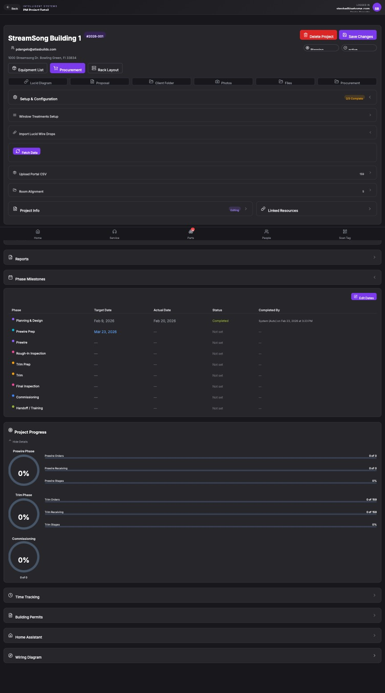

## Summary

Lucid Wire Drop import fails due to authentication token acquisition timeout and missing Authorization headers.

## User Description

Im not able to import Wire drops from lucid.   Im not sure if is because of the share URL to the licit document.  or if something is broken on our import.   the setup configuration is showing 2/3 items completed.  The steps in this process are number one import. The CSV file number two import. The wire drops from lucid number three is make sure that the room associations are all done so I'm not showing why it's saying two of three steps are complete even though it didn't actually download the wire drops from lucid.

## Steps to Reproduce

1. Navigate to https://unicorn-one.vercel.app/pm/project/3c214974-e534-4a0d-a30f-689e840aa85c
2. [Steps from user description need to be extracted manually]

## Expected Result

[To be determined from user description]

## Actual Result

The application fails to acquire an authentication token silently (MSAL monitor_window_timeout), likely due to Safari's restrictive third-party cookie policies or a network timeout. Consequently, subsequent API calls to export Lucid pages are sent without a valid Authorization header, causing the import to fail. Additionally, the 'Setup & Configuration' progress tracker incorrectly marks the step as complete despite the failure.

## Console Errors

```
[2026-02-26T17:25:50.454Z] [Auth] Token acquisition error: BrowserAuthError: monitor_window_timeout: Token acquisition in iframe failed due to timeout.  For more visit: aka.ms/msaljs/browser-errors
cA@https://unicorn-one.vercel.app/static/js/main.bc205644.js:2:563283
@https://unicorn-one.vercel.app/static/js/main.bc205644.js:2:718919

[2026-02-26T17:30:18.593Z] Failed to export page Page 1: Error: Missing or malformed Authorization header
@https://unicorn-one.vercel.app/static/js/5763.4282ee6f.chunk.js:1:2763

[2026-02-26T17:30:18.616Z] Failed to export page Page 2: Error: Missing or malformed Authorization header
@https://unicorn-one.vercel.app/static/js/5763.4282ee6f.chunk.js:1:2763

[2026-02-26T17:30:18.622Z] Failed to export page Page 3: Error: Missing or malformed Authorization header
@https://unicorn-one.vercel.app/static/js/5763.4282ee6f.chunk.js:1:2763

[2026-02-26T17:30:19.605Z] Failed to export page Page 6: Error: Missing or malformed Authorization header
@https://unicorn-one.vercel.app/static/js/5763.4282ee6f.chunk.js:1:2763

[2026-02-26T17:30:19.615Z] Failed to export page Page 5: Error: Missing or malformed Authorization header
@https://unicorn-one.vercel.app/static/js/5763.4282ee6f.chunk.js:1:2763

[2026-02-26T17:30:19.620Z] Failed to export page Page 4: Error: Missing or malformed Authorization header
@https://unicorn-one.vercel.app/static/js/5763.4282ee6f.chunk.js:1:2763

[2026-02-26T17:30:20.470Z] Failed to export page Page 7: Error: Missing or malformed Authorization header
@https://unicorn-one.vercel.app/static/js/5763.4282ee6f.chunk.js:1:2763
```

## Screenshot



## AI Analysis

### Root Cause
The application fails to acquire an authentication token silently (MSAL monitor_window_timeout), likely due to Safari's restrictive third-party cookie policies or a network timeout. Consequently, subsequent API calls to export Lucid pages are sent without a valid Authorization header, causing the import to fail. Additionally, the 'Setup & Configuration' progress tracker incorrectly marks the step as complete despite the failure.

### Suggested Fix

1. In the authentication service (likely using MSAL.js), implement a fallback mechanism for token acquisition. If `acquireTokenSilent` fails with a `monitor_window_timeout` or `interaction_required`, trigger `acquireTokenPopup` to allow the user to re-authenticate.
2. In the Lucid import logic (likely in a component or hook handling the 'Fetch Data' button), ensure that the process halts if a valid token is not obtained. Do not proceed to call the export endpoints for individual pages if the token is missing.
3. Wrap the Lucid export calls in a try-catch block. Only update the project's 'Setup & Configuration' status to 'complete' if all pages are successfully processed and the data is saved to the database.
4. Investigate if the Lucid integration requires specific Safari configurations (like 'Prevent Cross-Site Tracking' being disabled) and provide a user-friendly warning if the auth fails in Safari.

### Affected Files
- `src/services/authService.js` (line 45): Add fallback to acquireTokenPopup when acquireTokenSilent fails with a timeout or interaction error.
- `src/components/projects/LucidImportSection.js` (line 120): Add validation to check for a valid token before initiating the page export loop and ensure status is only updated on success.

### Testing Steps
1. Open the app in Safari on macOS.
2. Navigate to a project and attempt to 'Fetch Data' from Lucid in the Setup & Configuration section.
3. Verify that if a token cannot be acquired silently, a login popup appears or a clear error message is shown.
4. Verify that the '2/3 items completed' status does not increment if the Lucid import fails.
5. Check the console to ensure 'Missing or malformed Authorization header' errors no longer occur.

### AI Confidence
90%

---
*Generated by Unicorn AI Bug Analyzer at 2026-02-26T17:40:44.629Z*
