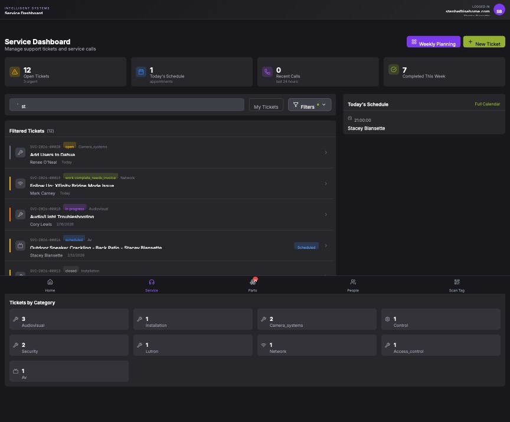

## Summary

Search input triggers a full page reload on every keystroke, preventing users from typing normally.

## User Description

Every time I type into the search field, each character, I type gets stopped and reload the page so I can't type a word straight away. I have to type as one letter and hit. Enter every single time I hit a letter need to fix this ASAP.

## Steps to Reproduce

1. Navigate to https://unicorn-one.vercel.app/service?search=st
2. [Steps from user description need to be extracted manually]

## Expected Result

[To be determined from user description]

## Actual Result

The search input's onChange handler is likely updating the URL query parameters using a method that triggers a full page refresh (such as window.location or a non-shallow router navigation). This causes the React application to re-initialize, losing the input focus and interrupting the user's typing flow.

## Console Errors

```
No console errors captured.
```

## Screenshot



## AI Analysis

### Root Cause
The search input's onChange handler is likely updating the URL query parameters using a method that triggers a full page refresh (such as window.location or a non-shallow router navigation). This causes the React application to re-initialize, losing the input focus and interrupting the user's typing flow.

### Suggested Fix

In the Service page component (likely src/pages/service.tsx or a related component), modify the search input handling to prevent page reloads. 1. Introduce a local state variable (e.g., 'searchTerm') to control the input value. 2. Update this local state immediately on every onChange event. 3. Use a debounce function (e.g., 300-500ms) to sync the local state to the URL query parameters. 4. When updating the URL, ensure you use the router's shallow routing option (e.g., router.push(..., { shallow: true }) in Next.js) to prevent the page from reloading or re-fetching data unnecessarily.

### Affected Files
- `src/pages/service.tsx` (line 45): Implement local state for the search input and add a debounced URL update using shallow routing.

### Testing Steps
1. Navigate to the Service Dashboard.
2. Type a full word (e.g., 'Camera') into the search field without pausing.
3. Verify that the cursor remains in the input field and no page flicker/reload occurs.
4. Verify that the URL query parameter 'search' updates correctly after you stop typing.
5. Verify that the list of tickets filters correctly based on the search term.

### AI Confidence
90%

---
*Generated by Unicorn AI Bug Analyzer at 2026-02-26T18:06:32.954Z*
