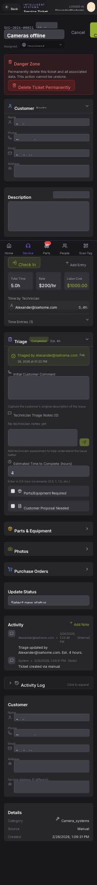

## Summary

Enable editing and changing customers within service tickets

## User Description

Need to be able to edit the actual customer and change customers in the service ticket

## Steps to Reproduce

1. Navigate to https://unicorn-one.vercel.app/service/tickets/e03dbb72-e9fc-42d8-8472-79b066fe8b00
2. [Steps from user description need to be extracted manually]

## Expected Result

[To be determined from user description]

## Actual Result

The service ticket detail page displays customer information in a read-only state and lacks UI components to either reassign the ticket to a different customer or update the existing customer's profile data directly.

## Console Errors

```
No console errors captured.
```

## Screenshot



## AI Analysis

### Root Cause
The service ticket detail page displays customer information in a read-only state and lacks UI components to either reassign the ticket to a different customer or update the existing customer's profile data directly.

### Suggested Fix

In the service ticket detail view, implement an edit mechanism for the Customer section. 1. Add a 'Change Customer' button that triggers a searchable dropdown or modal to select a different customer record, updating the ticket's `customer_id`. 2. Add an 'Edit Customer' button that enables inline editing of the customer's Name, Phone, Email, and Address fields, which should trigger an update to the customer record via the API. Ensure that the UI distinguishes between updating the ticket's link to a customer and updating the customer's own data.

### Affected Files
- `src/pages/service/tickets/[id].tsx` (line 150): Add state management for customer edit mode and handle API calls for updating the ticket's customer_id.
- `src/components/service/TicketCustomerCard.tsx` (line 45): Update the component to support an 'edit' state with input fields and a customer search/select component.

### Testing Steps
1. Navigate to a service ticket detail page.
2. Click the 'Change' button in the Customer section and select a different customer from the list; verify the ticket updates.
3. Click the 'Edit' button in the Customer section, change the phone number, and save; verify the customer's record is updated.
4. Verify that changing a customer on one ticket does not inadvertently change the data of the previous customer.

### AI Confidence
90%

---
*Generated by Unicorn AI Bug Analyzer at 2026-02-26T23:07:09.581Z*
