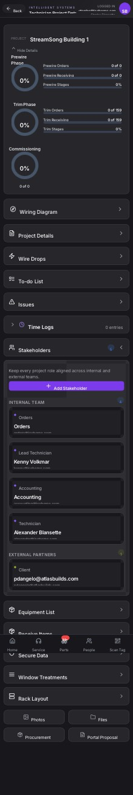

## Summary

Implement stakeholder email notification and external portal confirmation workflow with status indicators

## User Description

We need a way to send an email to any steakholder that gets added letting them know they are a part of the project.   This is especially true of the external steakholders.   It would be great to ask them to click a button in and email link that takes them to a project portal page.   Then they confirm that their email was correct,  that they got the email adding them to the project.   And that they can reach the external portal,    Then inside the steakholders section.  Have a small indication dot that shows they have been added to the project and they have confirmed by accessing the external portal

## Steps to Reproduce

1. Navigate to https://unicorn-one.vercel.app/project/3c214974-e534-4a0d-a30f-689e840aa85c
2. [Steps from user description need to be extracted manually]

## Expected Result

[To be determined from user description]

## Actual Result

The application lacks a stakeholder confirmation workflow. This is a full-stack feature request requiring database schema updates to track confirmation state and tokens, backend logic for email dispatch and token verification, a new external portal route for handling the confirmation click, and frontend UI updates to display the confirmation status indicator.

## Console Errors

```
No console errors captured.
```

## Screenshot



## AI Analysis

### Root Cause
The application lacks a stakeholder confirmation workflow. This is a full-stack feature request requiring database schema updates to track confirmation state and tokens, backend logic for email dispatch and token verification, a new external portal route for handling the confirmation click, and frontend UI updates to display the confirmation status indicator.

### Suggested Fix

Step 1: Database Update - Add `confirmation_status` (enum: 'pending', 'confirmed') and `confirmation_token` (string) to the Stakeholder/Project relation schema.
Step 2: Backend API (Add Stakeholder) - Update the endpoint that adds a stakeholder to generate a secure, unique `confirmation_token`, set status to 'pending', and trigger an email via the email service.
Step 3: Email Service - Create an email template for stakeholders. The email should include a link to the external portal: `https://[portal-domain]/confirm-access?token=[confirmation_token]`.
Step 4: Backend API (Confirm) - Create a new public endpoint `POST /api/stakeholders/confirm` that accepts the token, verifies it, updates the stakeholder's `confirmation_status` to 'confirmed', and nullifies the token.
Step 5: External Portal UI - Create a new route `/confirm-access` that extracts the token from the URL, calls the confirmation API, and displays a success message to the user.
Step 6: Main App UI - Update the Stakeholder list component. Map the `confirmation_status` to the indicator dot UI (e.g., hollow/gray dot for 'pending', solid green dot for 'confirmed').

### Affected Files
- `backend/src/models/Stakeholder.js` (line 1): Add confirmationStatus (default: 'pending') and confirmationToken fields to the schema.
- `backend/src/controllers/stakeholderController.js` (line 1): Update addStakeholder to generate token and send email. Add new confirmStakeholder method.
- `backend/src/services/emailService.js` (line 1): Add sendStakeholderInviteEmail function with the portal confirmation link.
- `frontend/src/components/Stakeholders/StakeholderCard.jsx` (line 1): Update the indicator dot logic to reflect the stakeholder's confirmationStatus.
- `portal/src/pages/ConfirmAccess.jsx` (line 1): New page to handle the email link click, call the backend confirmation endpoint, and show success state.

### Testing Steps
1. Create a new external stakeholder in a test project with a valid test email address.
2. Verify the UI immediately shows the stakeholder with a 'pending' indicator dot.
3. Check the test email inbox for the invitation email and verify the link contains a valid token.
4. Click the link to open the external portal and verify the success message is displayed.
5. Return to the main application, refresh the stakeholders list, and verify the indicator dot has changed to the 'confirmed' state.

### AI Confidence
95%

---
*Generated by Unicorn AI Bug Analyzer at 2026-03-06T12:55:37.303Z*
